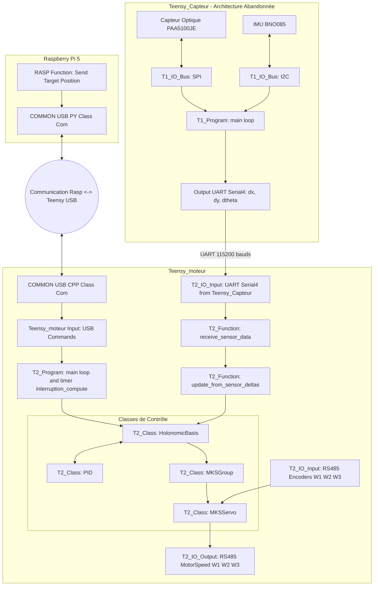

:::warning À refaire
Ces schémas doivent être repris et mis à jour.
:::

Ces diagrammes Mermaid ont été générés fidèlement à partir du fichier de conception original (`schema_info_v2.drawio`).

## 1. Architecture Matérielle et Communication

Ce diagramme illustre le cheminement des données depuis les algorithmes de la Raspberry Pi jusqu'aux moteurs, ainsi que le système de remontée des capteurs.

:::danger Doute sur l'intégration matérielle issu du .drawio
Le schéma d'origine mentionne explicitement une `Teensy_Capteur` (T1) distincte de la `Teensy_moteur` (T2), dialoguant via un bus UART à 115200 bauds. Comme précisé dans la vue d'ensemble, cette architecture de filtrage par Kalman (T1) a été abandonnée et n'est pas déployée dans la version post-CDR. Le diagramme la conserve ici pour archiver l'architecture de référence initialement visée.
:::

