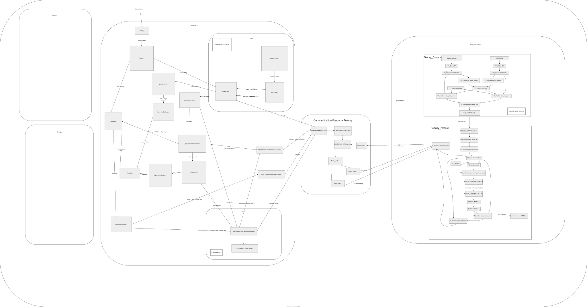

:::warning À refaire
Ces schémas doivent être repris et mis à jour.
:::

Ces diagrammes Mermaid ont été générés fidèlement à partir du fichier de conception original (`schema_info_v2.drawio`).

## 1. Architecture Matérielle et Communication

Ce diagramme illustre le cheminement des données depuis les algorithmes de la Raspberry Pi jusqu'aux moteurs, ainsi que le système de remontée des capteurs.

:::warning
Ce schéma est daté de la période deux teensy, mais nous allons sûrement rester sur cette logique pour l'année 26/27. 
La seule partie à ne pas prendre en compte est la partie lidar, pas du tout à jour. Sinon, le reste est l'archi actuelle.
:::

