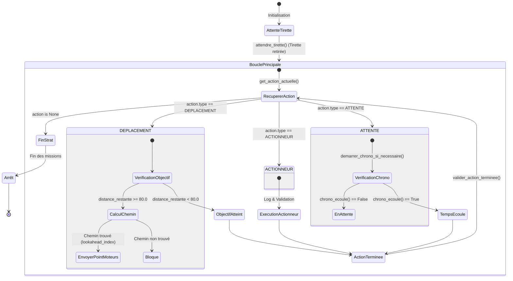

Ce module décrit la prise de décision globale du robot, la machine à états de la stratégie, et les mécanismes de pathfinding (recherche de chemin) employés pendant le match de 90 secondes.

## Boucle Principale (`update`)

La méthode `update()` de la classe `Robot` (dans `robot.py`) est appelée en boucle (à environ 20 Hz) par `main.py` après le retrait de la tirette. Elle effectue les opérations suivantes :

1. **Lecture de la position** courante (`teensy_x`, `teensy_y`, `teensy_theta`) issue de la carte Teensy.
2. **Mise à jour de la pose du LiDAR** et récupération des obstacles dynamiques (adversaire détecté par LiDAR avec `opp_conf > 0.1`).
3. **Publication optionnelle vers Rerun** (interface de visualisation).
4. **Interrogation de la stratégie** (`self.strategie.get_action_actuelle()`) pour obtenir l'action courante.
5. **Exécution de l'action** (déplacement via le PathFinder, exécution d'un actionneur ou attente).

## Machine à États de Haut Niveau (Stratégie)

Le fichier `strategy_strat_manager.py` définit la classe `StratManager`. La stratégie est implémentée comme une séquence d'actions qui sont exécutées de manière ordonnée. Les types d'actions sont définis dans `strategy_actions.py` via l'énumération `TypeAction` :

- `DEPLACEMENT` : Utilise le `PathFinder` pour se rendre à des coordonnées cibles.
- `ACTIONNEUR` : Utilise les bras, pinces, pompes, etc.
- `ATTENTE` : Met le robot en pause (ex: attendre qu'un actionneur se termine).

La méthode `valider_action_terminee()` permet d'incrémenter `etape_actuelle` et de passer à l'action suivante une fois la condition de l'action validée.

### Séquence de Match Implémentée

Actuellement, la liste des actions est définie en dur dans la méthode `_generer_strategie()` de `StratManager` et contient la séquence suivante :

{/*robot1/rasp/strategy/strategy_strat_manager.py*/}

```python
    def _generer_strategie(self):
        """Génère la liste des actions à effectuer pendant les 90s."""
        actions = []

        # 1. Sortir de la zone de départ
        actions.append(Action(TypeAction.DEPLACEMENT, cible_x=500, cible_y=500))
        # ...
        # 5. Retourner à la base
        actions.append(Action(TypeAction.DEPLACEMENT, cible_x=200, cible_y=200))

        return actions
```

### Schéma de la Machine à États



## Terrain et Pathfinding

### `Terrain` (`terrain_jeu.py`)

La classe `Terrain` maintient les propriétés physiques du terrain :

- **Dimensions** : `FIELD_WIDTH_MM = 3000`, `FIELD_HEIGHT_MM = 2000`.
- **Robot** : `ROBOT_RADIUS_MM = 120`.
- **Obstacles Statiques** : "Grenier" (`x_blue=600, y_blue=1550, width=1800, height=450`) et "Nid Adverse" (`x_blue=0, y_blue=1550, width=600, height=450`).
- **Positions de Départ** : Gérées avec symétrie selon la couleur (BLEU ou JAUNE) via le dictionnaire `START_POSITIONS`.
- **Balises** : Accessibles via `BeaconLayout.get_beacon()`.

### `PathFinder` (`pathfinder.py`)

:::warning
Implémenté, non testé en match
:::

L'algorithme A* utilisé par le robot holonome prend en compte l'orientation. Ses principales caractéristiques sont :

- **Grille** : Quadrillage avec un `GRID_SIZE = 50` mm et une marge de sécurité `MARGIN = 40` mm (`inflation_radius = ROBOT_RADIUS_MM + MARGIN`).
- **Obstacles Statiques** : Gonflés à l'initialisation de la classe sur une matrice `static_grid` (`_build_static_grid`).
- **Obstacles Dynamiques** : Injectés lors de l'appel à `create_dynamic_grid()` à partir des données transmises par le LiDAR.
- **Coût Orienté** : Le mouvement est pénalisé s'il diffère fortement de l'angle courant du robot (pour favoriser les déplacements fluides pour un robot holonome), avec une pénalité `orientation_penalty` allant de `1.0` (droit devant) jusqu'à `1.3` (mouvement inverse).
- **Lookahead** : Dans `robot.py`, un point situé plus loin sur le chemin A* calculé est choisi comme point de consigne aux moteurs (entre l'index `1` et `4` plus loin dans la liste du chemin selon la valeur de `dist_to_target`), afin de lisser la trajectoire en évitant le hachage point par point. L'objectif immédiat envoyé aux moteurs via la méthode `_envoyer_position_moteurs()` est continuellement rafraîchi lors de l'exécution d'une action de type `DEPLACEMENT`.

{/*robot1/rasp/robot.py*/}

```python
            pos    = {'x': rx, 'y': ry, 'theta': rtheta}
            chemin = self.cerveau.get_path(pos, objectif, obstacles)
```
