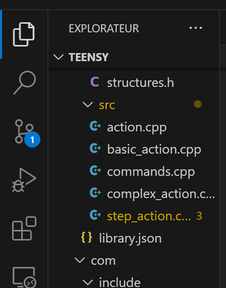
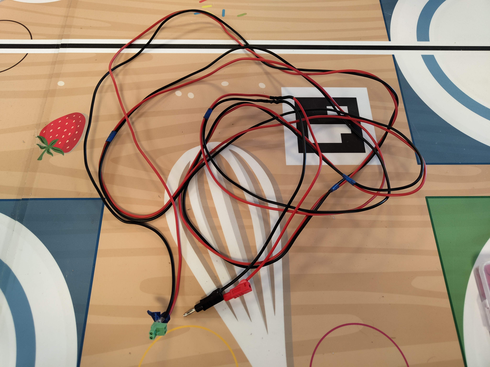
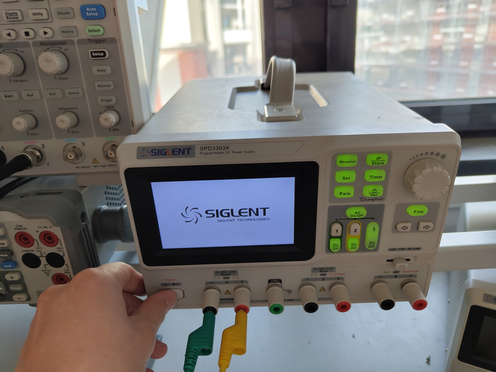
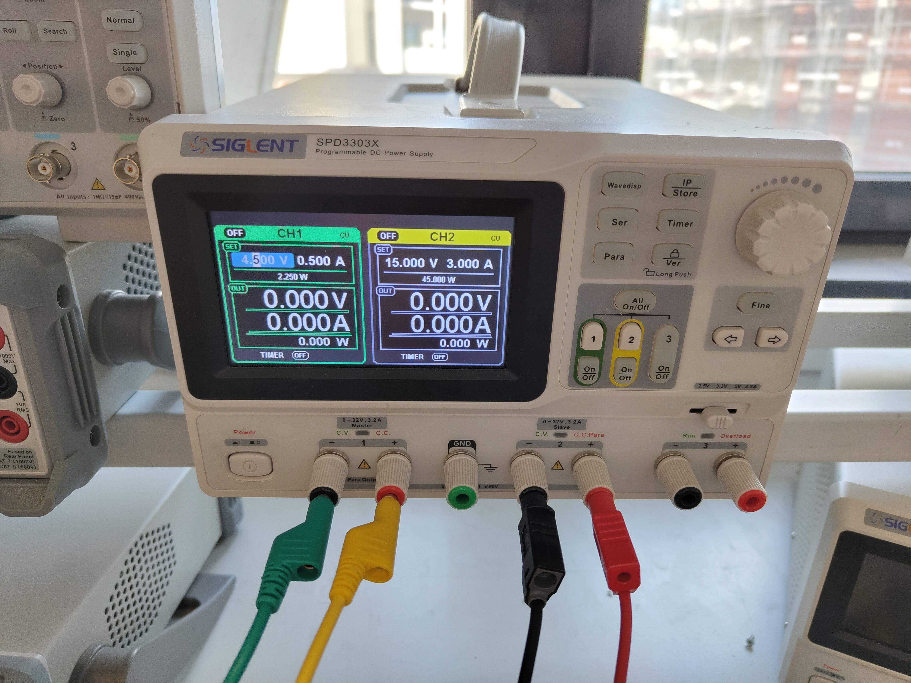
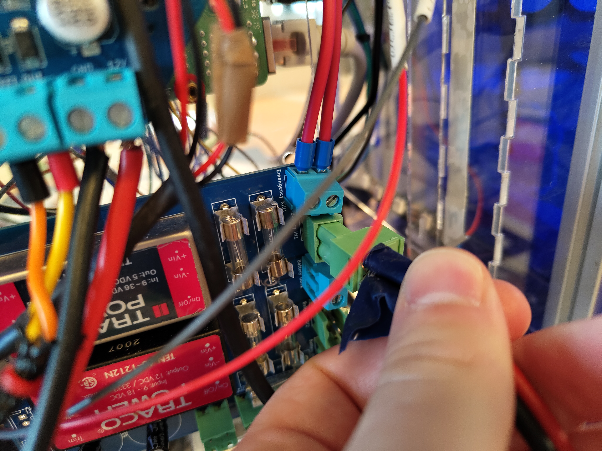
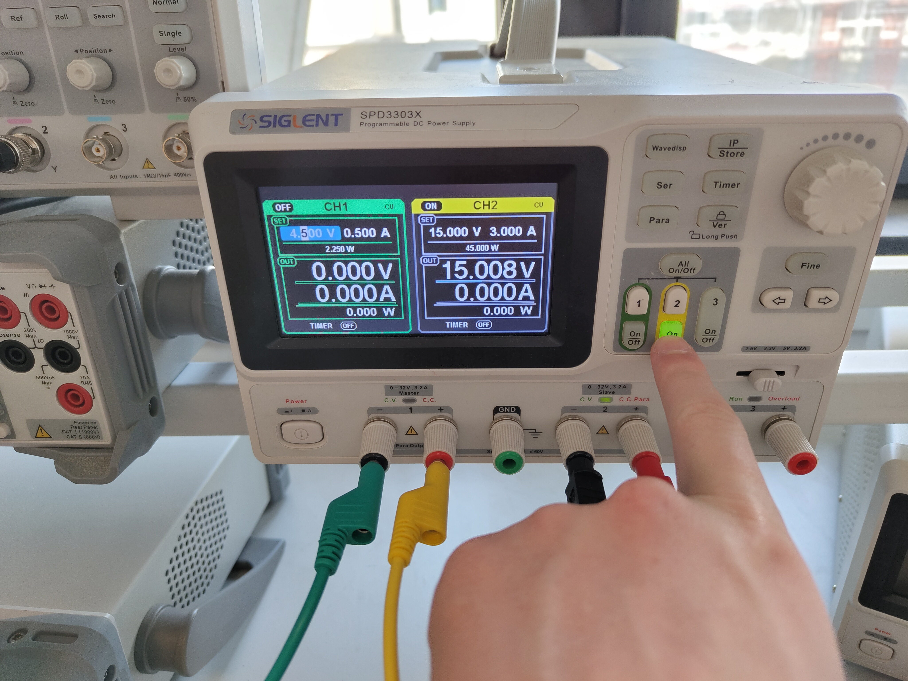

# Ajouter une clef SSH

Owner: Urbain LANTRES
Verification: Vérifiée

Une fois un client SSH installé sur l’ordinateur :

- Dans le dossier ~/.ssh, si vous avez déjà id_rsa et id_rsa.pub, sautez l’étape suivante
- Sinon veuillez faire la commande

    ```bash
    ssh-keygen -b 4096 -t ed25519 -f id_rsa
    ```

- puis on copie la clef publique sur le robot *(faire la commande dans powershell, pas dans cmd)*

    ```bash
    cat ~/.ssh/id_rsa.pub | ssh dvb@192.168.0.158 "mkdir -p ~/.ssh && cat >> ~/.ssh/authorized_keys"
    ```

- Tada 🎉

# Compilation teensy_loader_cli

Owner: Urbain LANTRES
Verification: Vérifiée

```jsx
git clone https://github.com/PaulStoffregen/teensy_loader_cli
sudo apt-get install libusb-dev
cd teensy_loader_cli
make
sudo mv teensy_loader_cli /bin/teensy_loader_cli
```

One liner (pas encore testé) :

```jsx
 git clone https://github.com/PaulStoffregen/teensy_loader_cli && sudo apt-get install libusb-dev && cd teensy_loader_cli&& make && sudo mv teensy_loader_cli /bin/teensy_loader_cli
```

# Flasher du code sur la Teensy depuis son PC

Owner: Urbain LANTRES
Verification: Expirée

Dans VS code, sur le réseau du calcul déporté, et avec la clef SSH configuré (il faut que vous puissiez vous connecter sans devoir mettre le mot de passe)

- Ouvrir le Dossier Teensy (ou le workspace rolling_basis)

    

- ouvrir la palette de commande (`ctrl + P`)

    

- Entrer `task`+ un espace

    

- puis chercher `Compile and flash robot1`

    

- Appuyer sur `ENTER` et tada 👌

Le raccourci clavier `CTRL + MAJ + B`  peut être utilisé

# Connection à la Rasp du robot

Une fois le robot allumé:

- Attendre que le réseau wifi `DVB_CDR` apparaisse
- S’y connecter avec le MDP `ROAD_T0_TOP1`  (Tzero)
- Une fois sur le réseau wifi, vous pouvez vous connecter en SSH avec le nom d’utilisateur `dvb` et le mdp `dvb` *****(rappel de la commande : `ssh dvb@rob.local`)*
- Tada 🎉

Pour Nantes le wifi est `DVB` avec le mdp `davincibot`.
Pour se connecer en ssh a la rasp, le nom d'utilisateur est `cdr-nantes` et le mdp `Kerjuliette`
Voici la commande `ssh cdr-nantes@cdr`

**Pas fan de l'idée de mettre toute cet partie la sur le site par contre**

# Setup pour dev

- Pré requis
  - Avoir Visual Studio Code
  - Un client git (CLI ou GUI)
- Cloner le repo github de la CDR sur votre ordinateur
- Télécharger les extensions conseillées (Plateform.io + les extensions python)
- Ouvrir le workspace `rolling_basis` / juste le dossier complet en fonction du dev en cours (cf Architecture Info )

# Démarrer le Robot sur secteur

Owner: Urbain LANTRES

Matériel nécessaire : câble d’alim CDR



- Allumer le générateur à côté de la table de jeu



- Ajuster les paramètres d’un Channel (préférence pour le 2) sur 15V 3A
- Brancher le câble sur les bornes + et - (rouge et noir resp.)



- Brancher le connecteur à la carte d’alimentation du robot (connecteur vert, 2e position en partant du haut)



- Allumer le Channel configuré précédemment



- Tada 🎉

# Pourquoi ces règles ?

Parce qu’à la CDR on a besoin de développer du code **rapide, simple, facile à tester, à débugger** mais surtout **simple à transmettre** au génération futur.

Le maître mot à la CDR (et dans quasi tous les autres projets) c’est **si ça marche on change pas**, **on réutilise**. Dans le meilleur des cas on réussit à optimiser mais sans compromettre ssa fonctionnalité.

**Vous n’êtes pas seul**. D’autres vous suivront et reliront votre code et donc doivent pouvoir le comprendre simplement. Ces futus membres projets n’auront peut-être pas l’expertise, néanmoins il faut *toujours* qu’ils puissent comprendre ce que vous faites.

# Règles basiques

- **READ THE FUCKING MANUAL :** Avant de coder lit la DOC des fonctions/classes que tu va potentiellement utiliser/modifier.
- **Lisibilité** : Rajouter des **Docstring et des commentaires**, les noms de variables doivent être **claires etexplicites** ⇒ Votre code doit être compréhensible pour un **A1 voir un Terminal**.
- **Fonctions courtes** : Divisez le code en petites fonctions ou méthodes qui accomplissent une **seule tâche**. Ca simplifie largement le code et sa compréhension.
- **Réutilisabilité** : Évitez la duplication de code en créant des fonctions réutilisables. La POO est faites pour la réutiliser au maximum le code. Penser toujours à **l’héritage, le polymorphisme** et autre concept de la POO. Si on vous apprend ça en cours c’est pas pour rien ! Alors avant de développer une nouvelle feature regardez si elle peut pas réutiliser un fonction/classe déjà existante, et si l’on peut utiliser les concepts de POO pour la développé. Il faut **toujours** rester dans cette dynamique POO.

# Règles Team Info

## Pourquoi ces règles ?

Parce qu’à la CDR on a besoin de développer du code **rapide, simple, facile à tester, à débugger** mais surtout **simple à transmettre** au génération futur.

Le maître mot à la CDR (et dans quasi tous les autres projets) c’est **si ça marche on change pas**, **on réutilise**. Dans le meilleur des cas on réussit à optimiser mais sans compromettre ssa fonctionnalité.

**Vous n’êtes pas seul**. D’autres vous suivront et reliront votre code et donc doivent pouvoir le comprendre simplement. Ces futus membres projets n’auront peut-être pas l’expertise, néanmoins il faut *toujours* qu’ils puissent comprendre ce que vous faites.

## Règles basiques

- **READ THE FUCKING MANUAL :** Avant de coder lit la DOC des fonctions/classes que tu va potentiellement utiliser/modifier.
- **Lisibilité** : Rajouter des **Docstring et des commentaires**, les noms de variables doivent être **claires etexplicites** ⇒ Votre code doit être compréhensible pour un **A1 voir un Terminal**.
- **Fonctions courtes** : Divisez le code en petites fonctions ou méthodes qui accomplissent une **seule tâche**. Ca simplifie largement le code et sa compréhension.
- **Réutilisabilité** : Évitez la duplication de code en créant des fonctions réutilisables. La POO est faites pour la réutiliser au maximum le code. Penser toujours à **l’héritage, le polymorphisme** et autre concept de la POO. Si on vous apprend ça en cours c’est pas pour rien ! Alors avant de développer une nouvelle feature regardez si elle peut pas réutiliser un fonction/classe déjà existante, et si l’on peut utiliser les concepts de POO pour la développé. Il faut **toujours** rester dans cette dynamique POO.

## Normes à utiliser

### Norme PEP8

<https://peps.python.org/pep-0008/>

<https://marketplace.visualstudio.com/items?itemName=ms-python.black-formatter>

#### 1. **Longueur des lignes**

- Limitez la longueur des lignes à **79** caractères pour le code et à **72** caractères pour les commentaires.

#### 2. **Espaces**

- Utilisez des espaces autour des opérateurs et après les virgules, mais **pas à l'intérieur** des parenthèses, crochets ou accolades.

#### 3. **Commentaires**

- Les commentaires doivent être *clairs et utiles*. Utilisez des commentaires en ligne pour expliquer des parties complexes du code.
- Les docstrings (chaînes de documentation) doivent être utilisées pour documenter les modules, fonctions, classes et méthodes.

#### 4. **Nommage**

- Utilisez des noms **explicites** pour les variables, fonctions, classes et modules.
- Les noms de variables et de fonctions doivent être en **minuscules** avec des mots séparés par des **underscores** (ex : `my_variable`).
- Les noms de classes doivent utiliser le style **CamelCase** (ex : `MyClass`).

#### 5. **Importations**

- Utilisez des importations absolues plutôt que relatives.

#### 6. **Espaces blancs**

- *Évitez les espaces blancs superflus à la fin des lignes ou à l'intérieur des parenthèses, crochets ou accolades*.

#### 7. **Structures de contrôle**

- Utilisez des lignes vides pour séparer les blocs de code logiquement distincts.
- Utilisez des parenthèses pour les expressions complexes dans les instructions `if`, `for`, `while`, etc.

## Tests

Vos features doivent être **TOUJOURS** testées. Cela paraît logique et basique mais *il faut le faire.*

**Testez vos features sur le robot** ! Ou alors lorsque ce n’est pas possible créez des **tests unitaires** pour vérifier que tout fonctionne !

**Faites des tests régressifs** ! Quand vous testez votre changement, vérifiez bien quece changement *ne change pas* le comportement du code de base. Si vous faites du refactoring c’est la même chose, le comportement du code ne doit pas *se dégrader*.

⇒ <https://www.youtube.com/watch?v=YMPlQCYp7xg>

## KISS

**KEEP IT SIMPLE, STUPID.**

Evitez la complexité inutile. Si une solution simple fonctionne, utilisez-la.

**Prenez du recul**. Lorsqu’on est dans un effet tunnel on ne prend pas assez de recul. On fonce tête baissée dans une solution qu’on pense être la meilleure, mais parfois ce n’est pas la plus simple.

## Pull request

A partir de maintenant les personnes pouvant merge dans la branche dev sont limités au nombre de 3 : **le responsable info PAMI, le responsable info ROB et le CDP**. Je vais nommer ces personne par Master.

Pour faire un merge il faut d’abord faire une Pull Request. Et les personnes habilités vont pouvoir relire, tester, demander des amendements et enfin merge dans dev.

Ces Pull Request seront gérer tous les jeudis.

Gérer les Pull Request c’est long. ***Très long***. Surtout quand on est 10 à développer. Donc pour faciliter cette tâche et ne pas perdre du temps **TOUTES** les règles ci-dessus sont à respecter, sinon on vous renvoie la balle jusqu’à ce que vous avez tout fixe.

Ca vous fait chiez ? Les master aussi. Mais si **TOUT** le monde respecte ces règles ci-dessus, tout le monde s’entendra bien et tout ira beaucoup plus vite, croyez le moi😉.

# Modules en Python

# L'asservissement c'est quoiii ? et  Setup PID

asservissement.md

# Kalman c'est quoi ??? ( Spécificité Nantes )

kalman.md

# Cinématique Holonome ( Spécificité Nantes)

cinematique.md

# Flasher une ESP32

# PlatformIO
