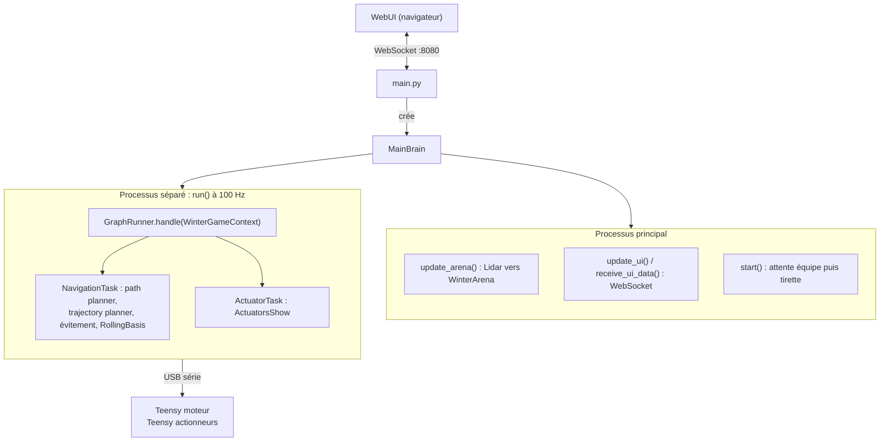

:::tip[En une phrase]
**Bot Ladyyy** est la sous-équipe informatique du **robot principal** (dossier `robot1/`) pour la Coupe de France de Robotique **2026**, thème *Winter is Coming*.
:::

## Objectif de la sous-équipe {/* #objectif */}

La sous-équipe Bot Ladyyy est responsable de **toute l'intelligence embarquée du robot principal** : elle transforme un châssis avec des moteurs, des servos et un lidar en un robot capable de jouer un match de la Coupe de France de Robotique de manière autonome.

Concrètement, le problème à résoudre est le suivant : pendant 100 secondes, le robot doit se localiser sur la table, décider quelles actions du règlement 2026 rapportent des points (**retourner les Jengas à la couleur de son équipe**, **déposer des éléments dans les zones de dépôt**, puis **rejoindre la zone d'arrivée (ninja stage)** en fin de match), planifier ses trajectoires, éviter le robot adverse détecté au lidar, et piloter ses actionneurs, le tout sans aucune intervention humaine après le retrait de la tirette (jack).

Pendant un match, le code du robot principal :

- attend la configuration de l'équipe (couleur, mode) via une interface web, puis le branchement et le retrait de la tirette ;
- exécute une **stratégie** sous forme de graphe de tâches (navigation + actionneurs) ;
- met à jour en continu une représentation de la table (l'*arène*) à partir du lidar pour l'évitement d'adversaire ;
- pilote deux cartes Teensy (base roulante et actionneurs) qui font le contrôle bas niveau.

Les interactions avec les autres sous-équipes : la **méca/élec** fournit le châssis, les cartes Teensy et le câblage (le protocole USB Rasp↔Teensy est la frontière entre les deux mondes) ; les **PAMIs** et la **Jetson** sont des systèmes indépendants qui partagent historiquement certaines bibliothèques du dossier `common/`.

Ce qu'un nouveau membre doit comprendre en premier : le robot est piloté par une Raspberry Pi qui exécute `robot1/rasp/main.py`. Toute la logique haut niveau (stratégie, navigation, évitement) est en Python sur la Pi ; tout le temps réel (PID moteurs, odométrie, servos) est en C++ sur des Teensy. La lecture de `main.py` puis de `brains/main_brain.py` donne le fil conducteur de tout le système.

## Vision globale de l'architecture {/* #architecture */}

### Vue d'ensemble matérielle

| Matériel                               | Rôle                                                                                                    | Liaison avec la Pi     | Code concerné                                                              |
| -------------------------------------- | ------------------------------------------------------------------------------------------------------- | ---------------------- | -------------------------------------------------------------------------- |
| Raspberry Pi                           | Exécute tout le Python : brain, stratégie, navigation, serveur WebSocket                                | /                      | `robot1/rasp/`                                                             |
| Teensy 4.1 « moteur »                  | Base roulante : drivers moteurs, encodeurs, 4 boucles PID (linéaire/angulaire/gauche/droite), odométrie | USB série 115200 bauds | `robot1/teensy_moteur/` (firmware), `controllers/rolling_basis/` (côté Pi) |
| Teensy 4.1 « actuator »                | ~10 servos (via PCA9685 en I2C), ascenseur à moteur pas-à-pas (A4988), switches, écran LCD              | USB série              | `robot1/teensy_actuator/` (firmware), `controllers/actuators/` (côté Pi)   |
| Lidar SICK TiM                         | Détection de l'adversaire → obstacles dans l'arène → évitement                                          | USB (lib `pysicktim`)  | `sensors/lidar/`                                                           |
| Capteur ultrason                       | Solution de repli pour l'arrêt sur obstacle                                                             | GPIO Pi                | `sensors/ultrasonic/`                                                      |
| Tirette (jack, pin 17) et BAU (pin 16) | Départ du match / arrêt d'urgence                                                                       | GPIO Pi (gpiozero)     | `sensors/inputs/`                                                          |
| Écran / tablette (WebUI)               | Choix équipe et mode, état du robot, réglage PID, tâches manuelles                                      | WebSocket port 8080    | `robot1/rasp/WebUI/`                                                       |

### Modules logiciels principaux

Le code Python est réparti entre `robot1/rasp/` (spécifique au robot) et `common/` (bibliothèques partagées) :

- **`main.py`** : point d'entrée. Construit dans l'ordre : les loggers, le serveur WebSocket (`wscomms`, routes `/cmd` et `/ui`), le lidar (ou un dummy selon la config), l'arène (`WinterArena`, le modèle de la table 2026), les entrées GPIO, puis le `MainBrain`. Il enregistre les tâches du brain et lance la boucle asyncio.
- **`brains/main_brain.py`** : le cœur du robot, construit sur la lib maison `taskbrain`. Chaque comportement est une tâche déclarée par décorateur `@Brain.task` : la boucle de contrôle `run()` (100 Hz, dans un **processus séparé**), la mise à jour de l'arène depuis le lidar, les échanges avec la WebUI, la séquence de départ (attente équipe → tirette branchée → tirette retirée → match).
- **`botladyyy_strategy/`** : le « pack stratégie » du jeu 2026 : les stratégies assemblées, les sous-graphes réutilisables, les tâches concrètes (navigation, actionneurs) et le `WinterGameContext` qui transporte l'état partagé (arène, base roulante, actionneurs, score).
- **`common/strategy/`** : le **framework de graphe de comportement** : un `GraphRunner` fait avancer des nœuds de tâches reliés par des transitions (directes ou conditionnelles, ex. accessibilité d'une zone) et des fonctions de score qui choisissent le prochain nœud. C'est ce qui permet au robot de replanifier en cours de match au lieu de dérouler un script linéaire.
- **`common/navigation/`** : la chaîne de navigation exécutée à chaque tick d'une tâche de navigation : **path planner** (A* sur la grille de l'arène) → **trajectory planner** (segments ligne droite / rotation / lissé, avec profils de vitesse) → **évitement « ACS »** (profils de détection configurables par type de déplacement) → commande de trajectoire envoyée à la base roulante.
- **`common/arena/`** : le modèle de la table : zones, grille pour l'A*, obstacles dynamiques issus du lidar. `WinterArena` est la déclinaison du règlement 2026 : **zones Jenga** (où ramasser/retourner/empiler les blocs), **zones de dépôt** (drop zones), **zone d'arrivée « ninja stage »**, et zones réservées jaune/bleue selon l'équipe.
- **`controllers/`** : les pilotes côté Pi des deux Teensy : `RollingBasis` (base roulante) et `ActuatorsShow` (actionneurs). Chacun a un **jumeau « dummy »** (dont une simulation temps réel de la base roulante) pour développer sans matériel.
- **`common/usb_com/`** : le protocole série Rasp↔Teensy, avec une implémentation Python et une implémentation C++ **partagées par lien symbolique dans les deux firmwares**, ce qui garantit la symétrie du protocole. Messages à identifiant sur 1 octet (0–127 Pi→Teensy : consignes de position, PID, PWM, servos… ; 128–255 Teensy→Pi : odométrie, états de switches, logs), trame terminée par une signature de fin et CRC8 optionnel.
- **`config.json`** (racine) : la configuration unique de tout le robot : ports, identifiants USB des Teensy, gains PID, profils de vitesse, angles des servos, zones par équipe, profils d'évitement, activation des dummies.

### Qui appelle quoi

Point important : la boucle `run()` tourne dans **son propre processus** et c'est elle qui **crée et possède** les objets `RollingBasis` et `ActuatorsShow`, car les handles pyserial ne peuvent pas être partagés entre processus. L'état partagé entre processus passe par le mécanisme `DictProxyAccessor` de `taskbrain`.

### Ordre de lancement

1. `start.sh` : active le venv puis lance `python main.py` (option `i` pour ouvrir Chromium sur la WebUI).
2. `main.py` construit loggers → serveur WS → lidar → arène → entrées → brain, puis démarre la boucle asyncio.
3. La WebUI se connecte ; `start()` attend le **mode** puis la **couleur d'équipe**, ce qui fixe la position de départ et initialise l'arène.
4. `run()` démarre les contrôleurs, met les PID à zéro, attend la **tirette branchée**, réinitialise odométrie et PID, attend la **tirette retirée** → le match démarre : le graphe de stratégie s'exécute en boucle, avec arrêt forcé des moteurs à 100 s.

### Pourquoi cette architecture

- **Séparation Pi / Teensy** : tout ce qui exige du temps réel dur (PID, odométrie, rampes des pas-à-pas) est dans le firmware C++ des Teensy ; la Pi n'envoie que des consignes. Le robot reste ainsi robuste aux latences de Python.
- **Séparation framework / jeu de l'année** : `common/` (strategy, navigation, arena, usb_com) est réutilisable d'une année sur l'autre ; seuls le pack `_strategy/` et l'arène (`WinterArena` cette année) changent avec le règlement.
- **Dummies partout** : chaque périphérique (base roulante, actionneurs, lidar) a une version simulée activable par la config, ce qui permet de développer et tester la stratégie complète sur un PC sans robot, avec visualisation matplotlib de l'arène.

## Choix techniques et erreurs historiques {/* #choix-techniques */}

### Choix qui ont bien fonctionné

- **La stratégie en graphe plutôt qu'en script linéaire.** Les stratégies sont des graphes de nœuds reliés par des transitions conditionnelles et des fonctions de score : si une zone devient inaccessible (adversaire), le runner choisit une autre branche. Les sous-graphes (`pickup`, `construct`…) sont réutilisables entre stratégies, ce qui a permis d'assembler plusieurs stratégies sans dupliquer de code.
- **Le protocole USB partagé Python/C++** (`common/usb_com/`) : la même définition des messages est utilisée côté Pi et compilée dans les deux firmwares via des liens symboliques dans `platformio.ini`. Impossible de désynchroniser les deux côtés du protocole.
- **Le contrôle bas niveau dans les Teensy** : les PID tournent à la fréquence du firmware, indépendamment de la charge de la Pi.
- **Les jumeaux « dummy »** avec simulation temps réel de la base roulante : la stratégie a pu être développée et déboguée sans accès au robot — d'autant plus précieux que le robot physique a été disponible tard (voir plus bas).
- **La config unique `config.json`** : un seul fichier pour les PID, les profils de vitesse, les angles servos, les zones par équipe — réglable au bord de la table sans toucher au code.
- **L'extraction des libs maison en packages pip** (`taskbrain`, `wscomms`, `loggerplusplus`) : elles sont versionnées et réutilisables sur les autres systèmes de l'équipe.

### Erreurs qui ont coûté du temps

- **Le robot a été assemblé trop tard.** Conséquence directe : **les PID de la base roulante ont été réglés sans le poids définitif du robot**. Un PID réglé sur un châssis allégé ne tient plus quand la masse finale (actionneurs, batterie, éléments de jeu embarqués) change l'inertie — il a fallu re-régler, dans l'urgence, ce qui aurait dû être stabilisé des semaines plus tôt. Règle à retenir : **ne considérer un réglage PID comme acquis que sur le robot en configuration de match (masse définitive)**.
- **Pas de tests réalistes en continu sur l'année.** Faute de robot entièrement assemblé, les tests sur table dans des conditions proches du match sont arrivés tard, et beaucoup de problèmes n'ont été découverts qu'à ce moment-là. La simulation dummy atténue le problème pour la stratégie, mais ne remplace pas les tests réels pour tout ce qui est mécanique, odométrie et interactions avec les éléments de jeu.

### Compromis acceptés et pièges connus

- **Le multi-process est une nécessité, pas un luxe.** La boucle de contrôle à 100 Hz ne pouvait pas tenir dans la boucle asyncio principale (GIL, latence) : `run()` a été déportée dans un processus séparé. Conséquence à connaître absolument : **les objets qui possèdent un port série doivent être créés dans le processus qui les utilise** (les handles pyserial ne se partagent pas), et tout état partagé doit passer par `DictProxyAccessor` avec des types sérialisables enregistrés dans `main.py`. Oublier cette règle donne des bugs difficiles à diagnostiquer.
- **La métaprogrammation de `taskbrain`** (marqueur `# --- MetaProg is insane (loop) --- #` qui transforme la suite d'une méthode en corps de boucle) est puissante mais opaque : il faut la connaître pour comprendre `main_brain.py`.
- **Le vocabulaire 2025 conservé dans le code 2026** : le pack stratégie a été adapté au règlement *Winter is Coming* mais en gardant des noms de l'ancien jeu (`banner_deployment`, `go_backstage`…). C'est fonctionnel mais trompeur pour un nouveau lecteur — ne pas se fier aux noms, lire les docstrings et les tâches réellement exécutées.

### Ce qu'il ne faut pas refaire

- **Laisser mourir le code de l'année précédente sans le supprimer** : `boombot_strategy/` (le robot de l'an dernier) n'existe plus qu'à l'état de `__pycache__`, et des commentaires de `main.py` référencent encore un `brains/controllers_brain.py` qui n'existe plus. Ce genre de vestige coûte du temps à chaque nouveau membre. Supprimer ou archiver franchement.
- **Garder du code « au cas où »** : `common/navigation/navigator/core/navigator.py` est marqué `# UNUSED` (remplacé par `navigator_task`) mais toujours présent.
- **Ne pas documenter au fil de l'eau** : le `README.md` du dépôt est resté vide toute l'année ; cette documentation est la première vue d'ensemble écrite du système.
- **Dépendre du calendrier méca / elek pour commencer à tester** : sans robot assemblé tôt, ni le réglage PID ni les tests réalistes ne peuvent avoir lieu. Prévoir dès le début d'année une base roulante de test représentative (ou un lest à la masse cible).

## Roadmap et vision pour l'année prochaine {/* #roadmap */}

### Démarche conseillée : des déplacements fiables d'abord

La leçon centrale de cette année : les actionneurs au complet arrivent très tardivement, et dès qu'ils sont là, il faut écrire le code dans l'urgence. Ce sprint final est inévitable — la seule variable qu'on contrôle, c'est que **tout le reste (déplacements, navigation, orchestration) soit nickel avant**. L'an prochain doit donc être construit dans cet ordre, et chaque étape doit être **réellement terminée** avant de passer à la suivante :

1. **Se mettre d'accord sur l'architecture cible et poser des jalons réalisables et datés.** Chaque jalon est aussi un point de réévaluation : on y confronte ce qui est fait à ce qu'on veut, et on ajuste la cible si nécessaire, plutôt que de découvrir l'écart en fin d'année.
2. **Une base roulante fonctionnelle uniquement sur Teensy.** Moteurs, encodeurs, PID et odométrie validés en autonome sur le firmware, sans dépendre de la Rasp ni du reste du code.
3. **Intégrer la communication avec la Rasp pour orchestrer tout le code**, en privilégiant **systématiquement l'exactitude des déplacements** : chaque ajout (protocole, navigation, évitement) se juge d'abord sur un critère unique — le robot va-t-il précisément et de façon répétable là où on lui demande ?
4. **Seulement ensuite : la stratégie et les actionneurs.** Ils ne valent rien sur une base qui ne se déplace pas de manière fiable, et ils peuvent en grande partie se développer en simulation (dummies) pendant que les étapes 1 et 2 se consolident.

### À conserver

- La séparation `common/` (framework pérenne) / `_strategy/` + arène de l'année (spécifique au règlement) : elle rend le passage d'une année à l'autre peu coûteux.
- Le framework de stratégie en graphe, le protocole `usb_com` partagé Python/C++, et l'approche « dummy » pour la simulation.
- Le contrôle bas niveau dans les Teensy.

### À revoir

- **La lisibilité de `main_brain.py`** (~800 lignes) : séparer la séquence de match, les échanges UI et les tâches de debug dans des modules distincts.
- **La transparence de `taskbrain`** : documenter (ou simplifier) le mécanisme de métaprogrammation des boucles, qui est aujourd'hui un savoir tribal.
- **La dépendance aux librairies externes** : ne pas dépendre de librairies externes non professionnelles qu'on ne peut modifier.
- **L'architecture globale** : revoir l'organisation du code pour améliorer la maintenabilité et la clarté.
- **L'archivage** : créer des releases github pour pouvoir supprimer les fichiers obsolètes, les commentaires inutiles et les modules non utilisés pour éviter la confusion.

### Dette technique et nettoyage prioritaire

1. Supprimer `boombot_strategy/` (pycache orphelin), le `navigator` marqué UNUSED, et les commentaires obsolètes de `main.py`.
2. Finir la migration `log_manager` → `loggerplusplus`.
3. Renommer les stratégies/sous-graphes/zones avec les termes du règlement 2026 (ou du suivant).
4. Écrire un `README.md` racine qui pointe vers cette documentation et le tutoriel PID.

### Objectifs techniques par étape

**Étape 1 — base roulante sur Teensy :**

- **Découpler le réglage PID du calendrier méca** : obtenir tôt une base roulante à la masse cible (lest si besoin), régler les PID dessus, et ne valider les gains définitifs que sur le robot en configuration de match. Outiller le protocole du tutoriel avec le `debug_recorder` pour re-régler vite quand la masse change.

**Étape 2 — orchestration Rasp, exactitude des déplacements :**

- **Mesurer l'exactitude, pas la supposer** : définir des tests de déplacement répétables (aller-retour, carré, rotations) avec un critère chiffré d'erreur de position, rejoués à chaque évolution du code de navigation.
- **Fiabiliser l'évitement** : les profils ACS sont configurés par type de déplacement dans `config.json` ; les valider systématiquement en simulation avec un adversaire simulé.

**Étape 3 — stratégie et actionneurs :**

- **Étendre la simulation** : la base roulante dummy simule le temps réel, mais un match complet simulé (adversaire + score) permettrait de comparer les stratégies avant les phases de test sur table.
- **Capitaliser sur le graphe de stratégie** : enrichir les fonctions de score (temps restant, points espérés) pour que le choix de branche en match soit réellement opportuniste.

**En transverse, toute l'année :**

- **Planifier des tests réalistes tout au long de l'année** : jalons réguliers de tests sur table (même partiels) plutôt qu'une campagne tardive ; c'est la leçon principale de cette année.
