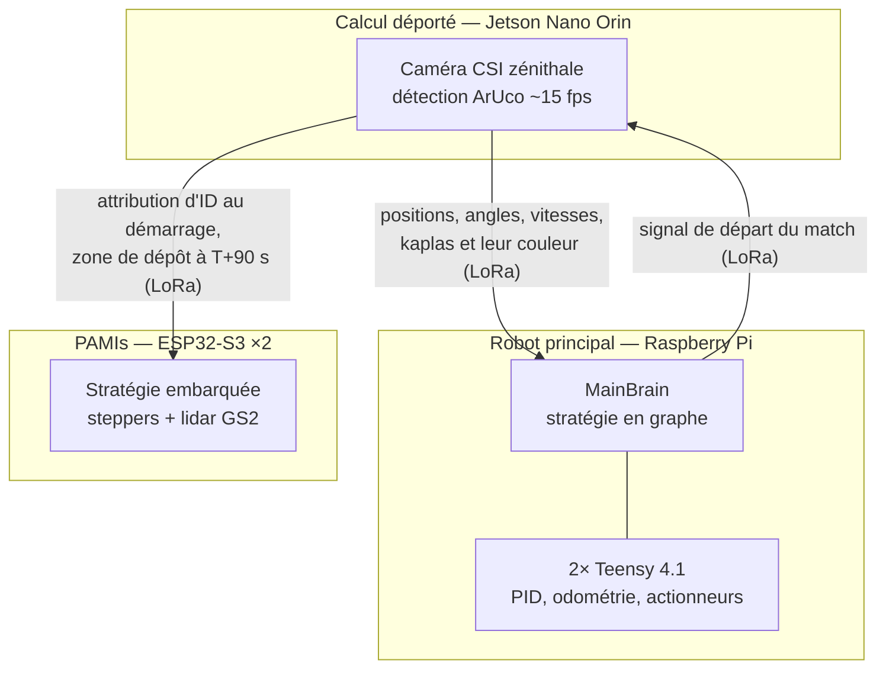

L'équipe Paris aligne **trois systèmes indépendants** pour la Coupe de France de Robotique 2026
(*Winter is Coming*). Chacun a sa propre documentation. Cette page décrit **comment ils s'articulent** et ce qui circule entre eux.

## Les trois systèmes {/* #systemes */}

| Système                                                     | Cerveau                     | Code      | Rôle pendant le match                                                                   |
| ----------------------------------------------------------- | --------------------------- | --------- | --------------------------------------------------------------------------------------- |
| [Robot principal](../robot-principal/index.md) (Bot Ladyyy) | Raspberry Pi + 2 Teensy 4.1 | `robot1/` | Marque les points : retourne les Jengas, dépose des éléments, rejoint la zone d'arrivée |
| [PAMIs](../pami/index.md)                                   | ESP32-S3 (×2)               | `PAMI/`   | Partent en fin de match exécuter leur trajectoire et actionner leur servo               |
| [Calcul déporté](../calcul-deporte/index.md)                | Jetson Nano Orin            | `jetson/` | Observe toute l'arène depuis une caméra zénithale et redistribue ce qu'il voit          |

La séparation est nette : chaque système démarre, se configure et joue son match de son côté. Le seul
lien entre eux est **radio**, en **LoRa** — le WiFi étant saturé dans une salle de Coupe.

## Ce qui transite entre eux {/* #echanges */}

- **Calcul déporté → robot principal** : l'essentiel du trafic. La Jetson envoie en continu la
  position, l'angle et la vitesse des éléments suivis, ainsi que les kaplas et leur couleur, pour que
  le robot adapte sa stratégie au lieu de jouer à l'aveugle.
- **Robot principal → calcul déporté** : le robot donne le signal de départ du match, à partir duquel
  la Jetson commence à détecter.
- **Calcul déporté → PAMIs** : au démarrage, chaque PAMI demande un identifiant à la Jetson ; vers
  **T+90 s**, la Jetson dirige chaque PAMI vers une zone de dépôt, en priorisant les zones les plus
  riches en kaplas de notre couleur et les plus proches.

C'est la Jetson qui gère l'identification des PAMIs, et non le robot, parce qu'elle est allumée bien
avant le début du match alors que le robot peut redémarrer pendant la préparation.

:::warning[Ce lien n'a pas servi en compétition]
L'orchestration des PAMIs par le calcul déporté est **écrite et fonctionnelle des deux côtés, mais
n'a jamais été jouée à la Coupe**. Côté PAMI, le LoRa a été testé sur des programmes minimalistes
sans jamais être intégré au firmware complet : la compétition s'est jouée avec `ENABLE_LORA false` et
une stratégie fixe codée en dur. Côté Jetson, le code d'attribution d'ID et d'assignation de zones
existe et est considéré comme propre.

Conséquence pratique : compiler un PAMI avec `ENABLE_LORA true` sans Jetson qui répond le laisse
**bloqué indéfiniment** au démarrage, sans timeout. Voir
[Débug des PAMIs](../pami/info/debug.md#lora-bloque).
:::

## Ce qu'un nouveau membre doit retenir {/* #a-retenir */}

1. **Les trois systèmes savent jouer seuls.** Le robot principal et les PAMIs ont chacun une
   stratégie embarquée qui fonctionne sans radio. C'est ce qui a été joué en 2026.
2. **Le LoRa est le goulot d'étranglement.** Il limite les échanges au strict minimum et interdit
   aujourd'hui toute vraie stratégie temps réel partagée entre la Jetson et le robot. Le remplacer
   par un canal bidirectionnel est la priorité commune identifiée par deux des trois sous-équipes.
3. **Coder en dur reste une option valable.** Les deux sous-équipes le notent : donner sa zone à
   chaque PAMI à la compilation fonctionne aussi, et reste beaucoup plus simple que l'orchestration
   radio.

## Pour aller plus loin {/* #pour-aller-plus-loin */}

- [Setup de l'environnement de dev](./setup.md) — les outils communs à tous les sous-projets.
- [Power delivery](./elek/power-delivery.md) — la carte d'alimentation.
- Les pages *Vue d'ensemble* de chaque sous-projet, pour l'architecture interne de chacun.
