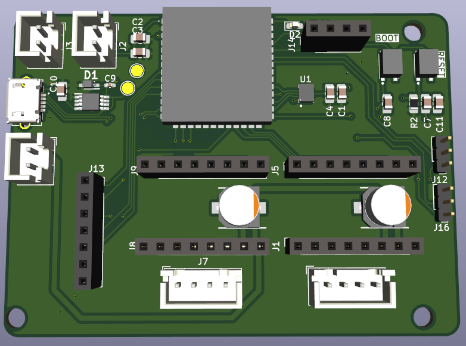
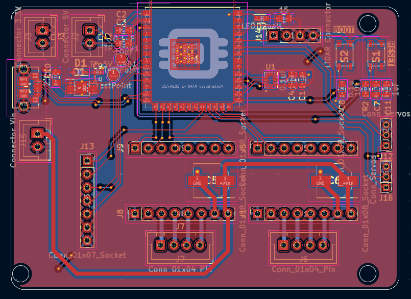

# Motherboard des PAMIs - ESP32S3

PCB KiCad fournissant la logique des PAMIs, de manière robuste et fiable

## Résumé

Objectif: Carte mère ESP32S3 pour PAMIs avec moteurs, capteurs et communication.

- Moteurs : Drivers A497 pour NEMA 17 5V
- Capteurs : IMU, LiDAR YD GS2
- Communication : Wifi, BLE, LoRa

## Routage

## Mapping des GPIO (ESP32-S3)

### Module LoRa (UART2)

| Signal LoRa | Net | GPIO ESP32-S3 |
| --- | --- | --- |
| TX | TX LoRa | GPIO16 |
| RX | RX LoRa | GPIO17 |
| Busy | UART Busy LoRa | GPIO18 |
| M0 | M0 | GPIO15 |
| M1 | M1 | GPIO14 |

### IMU (ICM-45686 — SPI)

| Signal IMU | Net | GPIO ESP32-S3 |
| --- | --- | --- |
| MOSI | MOSI IMU | GPIO35 |
| MISO | MISO IMU | GPIO37 |
| SCK | CLK IMU | GPIO36 |
| CS | SS IMU | GPIO38 |

### Drivers moteurs pas-à-pas

#### Moteur gauche

| Fonction | Net | GPIO ESP32-S3 |
| --- | --- | --- |
| DIR | DIR Left | GPIO03 |
| STEP | STEP Left | GPIO46 |
| ENABLE | EN Left | GPIO09 |

#### Moteur droit

| Fonction | Net | GPIO ESP32-S3 |
| --- | --- | --- |
| DIR | DIR Right | GPIO21 |
| STEP | STEP Right | GPIO47 |
| ENABLE | EN Right | GPIO48 |

### LiDAR (UART)

| Signal LiDAR | Net | GPIO ESP32-S3 |
| --- | --- | --- |
| TX | TX LiDAR | RX0 |
| RX | RX LiDAR | TX0 |

### Servomoteurs

| Servo | Net | GPIO ESP32-S3 |
| --- | --- | --- |
| Servo 1 | Data servo 1 | GPIO42 |
| Servo 2 | Data servo 2 | GPIO41 |
