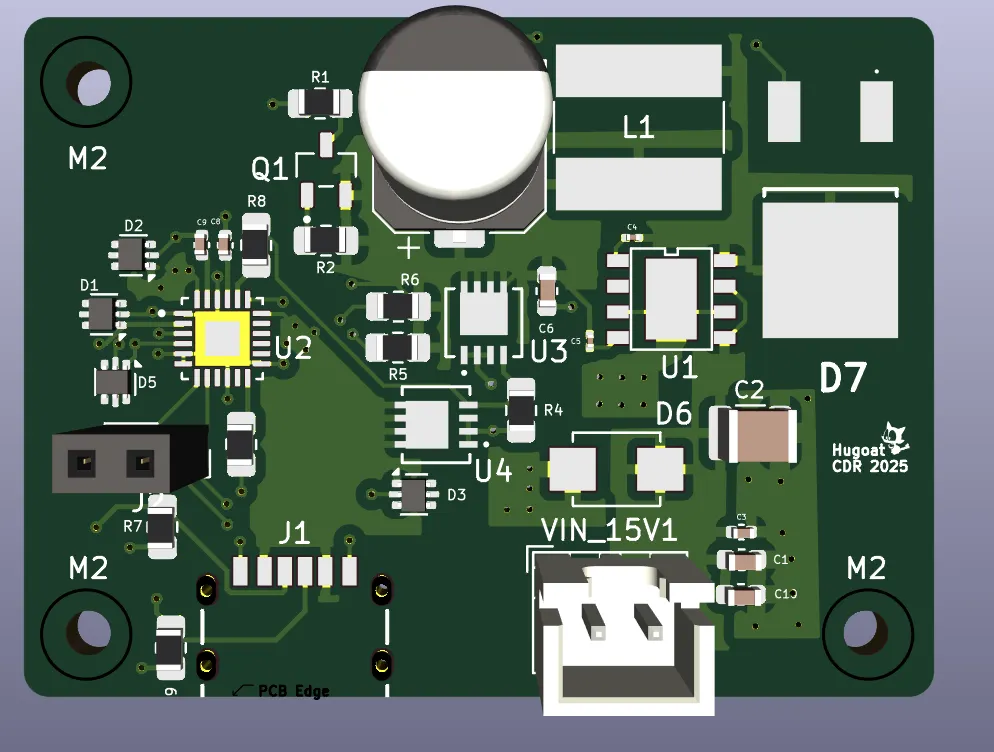
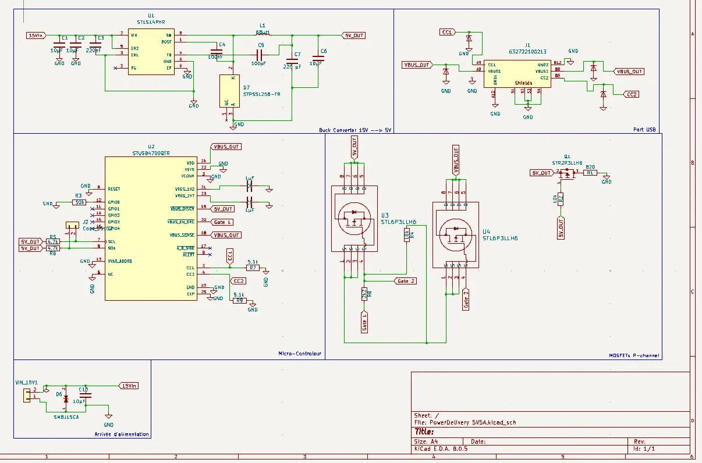
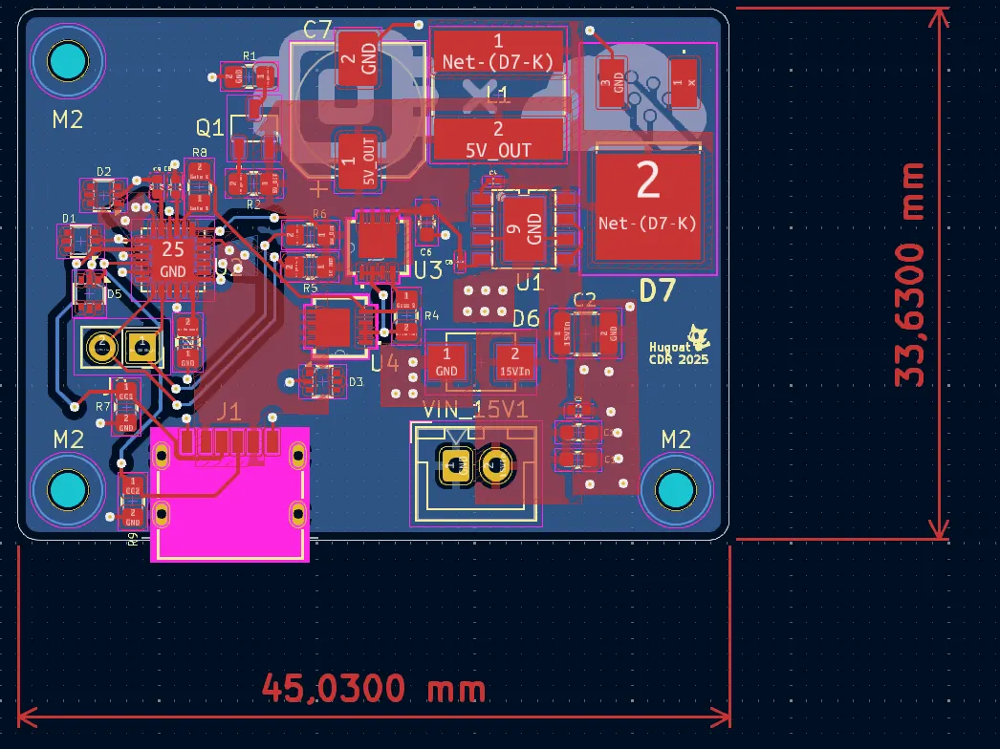

# Carte d'alimentation 5 V 5 A (PD) pour Raspberry Pi 5

PCB KiCad fournissant un rail stable de 5 V, 5 A adapté au Raspberry Pi 5.

## Résumé

- Objectif: Alimentation fiable 5,1 V, 5 A avec faible ondulation et protections robustes.
- Interface de sortie: USB-C vers Pi 5.
- Entrées: 9-24 V DC (JST GH 2,54 mm 2 broches).
- Topologie: Convertisseur DC/DC buck (abaisseur) avec contrôle de courant.
- Buts clés: Gérer les transitoires du Pi 5, minimiser la chute de câble, sécurité thermique.

## Spécifications clés

- Tension de sortie: 5,1 V ±2 % au connecteur carte sous 0-5 A
- Courant max: 5 A continu, 6 A crête (≤100 ms)
- Ondulation: ≤30 mV crête-à-crête (BP 20 MHz) à 5 A
- Protections: OVP, OCP, UVLO, inversion, court-circuit, thermique
- Rendement: ≥93 % à 5 V / 5 A (si conversion DC/DC)
- Compensation de câble: viser 5,05-5,2 V au niveau du Pi en charge (documenter la méthode)

## Schéma système

doc needed

## Interfaces

- Entrée:
  - JST GH 2,54 mm 2 broches (9-24 V DC)
- Sortie:
  - USB-C vers Pi 5 (5 V uniquement, assurer la capacité 5 A)
- Indicateurs: LED PGOOD, LED défaut
- Points de test: JST GH 2.54mm SDA/SCL

## Protections et sécurité

lol

## Aperçu du schéma

## Notes de routage PCB

## Règles et contraintes électriques (KiCad)

- Classes de nets:
  - 5V_HIGH_I: largeur min X mm, via Y/Z mm, écartement ≥0,4 mm
  - SW_NODE: court, keepout sous l'inductance
  - SIGNAL: largeur/écartement standard
- Règles de conception:
  - Diamètres de perçage pour connecteurs et fusibles choisis
  - Distance de fuite/isolement ≥1 mm sur le domaine 5 V, plus près des nœuds transitoires
- Vérifications: ERC propre, DRC propre, réseaux non connectés résolus

## Nomenclature (haut niveau)

- Contrôleur PD: [réf], méthode de config (EEPROM/MCU)
- Contrôleur/module buck: [réf], inductance [valeur, Isat], FETs [Rds(on)]
- Shunt: [valeur 1-2 mΩ, 4 bornes si possible], puissance ≥3 W
- Condensateurs de sortie: polymère low-ESR en vrac + mélange céramiques (documenter quantités/valeurs)
- Diodes TVS: cotes d'entrée et de sortie
- Connecteurs: réceptacle USB-C (5 A), en-têtes, jack/XT60
- Pads thermiques/isolants si utilisés

## Notes d'assemblage

- Type de pâte à souder, épaisseur de pochoir (p. ex., 120-130 μm)
- Conseils de soudure manuelle pour composants à forte masse
- Nettoyage et vernis de tropicalisation (le cas échéant)
- Étiquetage: polarité, révision, plage d'entrée, puissance de sortie

## Plan de test

- Mise en route:
  - Alimenter avec alimentation de labo à courant limité
  - Vérifier 5,1 V à vide, courant de repos
  - Échelon de charge: 0→5 A, mesurer chute/surtension et stabilisation
- Protections:
  - Seuil OCP et comportement reprise auto/verrouillé
  - Temps de réaction au court-circuit
  - Seuils UVLO/OVP
- Thermique:
  - 5 A en régime établi à 25 °C et 40 °C ambiant; enregistrer les points chauds
- USB-C PD:
  - Pour récepteur PD: vérifier contrat 5 V/5 A, détection câble e-marqué
- Régulation ligne/charge et balayage d'efficacité
- Conformité: pré-vérification EMI si applicable

## Intégration avec Raspberry Pi 5

- Câble: USB-C 5 A avec e-marker; noter la référence
- Tension au Pi sous 5 A ≥ 4,9 V (mesurée aux pastilles de test du Pi)
- Journal baisses/sous-tension: confirmer absence de bridage sous charges en rafales

## Fichiers de projet (KiCad)

- Projet: ./power-delivery.kicad_pro
- Schéma: ./power-delivery.kicad_sch
- PCB: ./power-delivery.kicad_pcb
- Sorties:
  - ./outputs/gerbers/
  - ./outputs/step/
  - ./outputs/pdf/

## Historique des révisions

- v0.1: Prototype initial
- v0.2: Thermique/vias améliorés, filtre LC mis à jour
- v1.0: Version

## Points ouverts / TODO

- Sélectionner le contrôleur PD final et valider la config
- Ajuster la compensation et l'amortissement LC
- Finaliser largeurs de plans et nombre de vias
- Compléter les rapports de test et joindre les courbes
