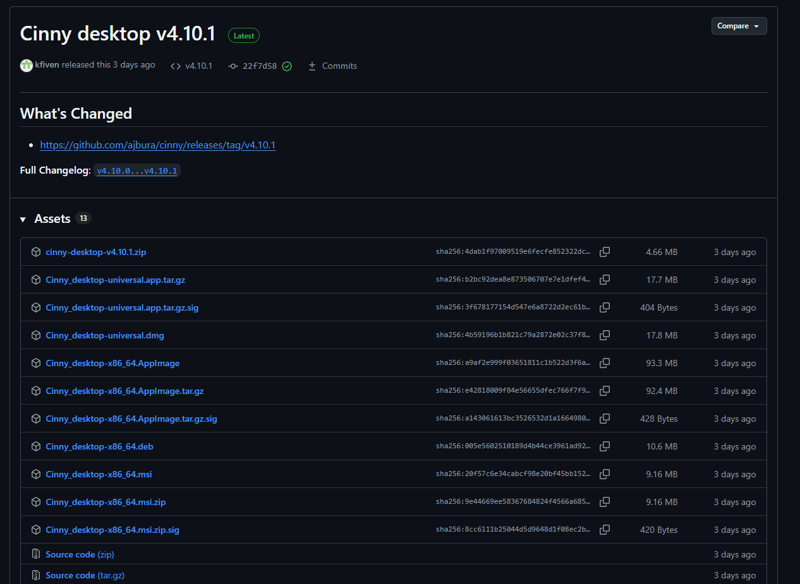
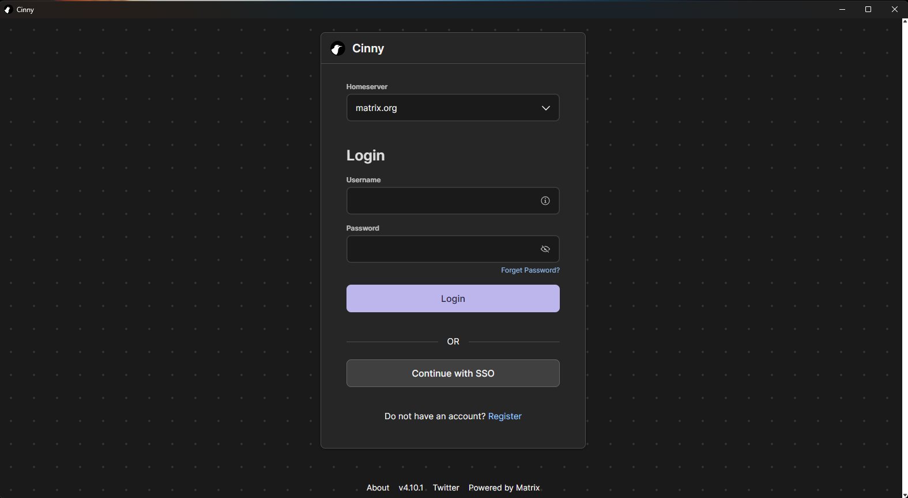
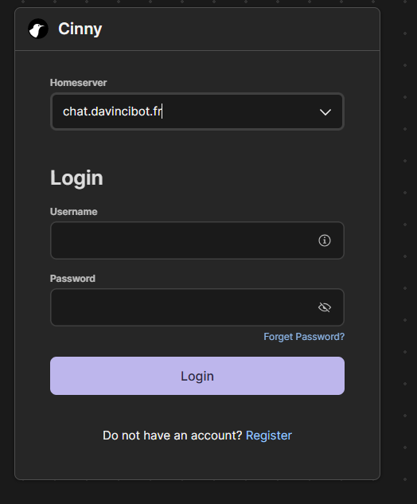
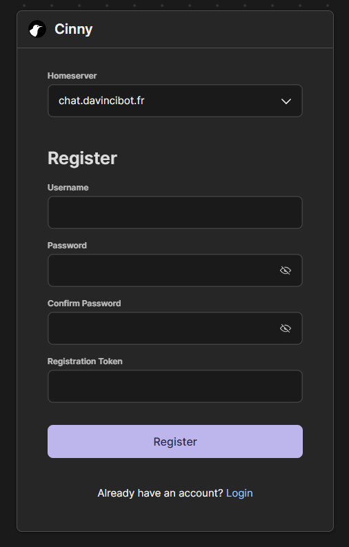
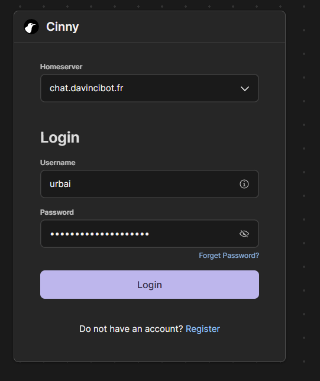

# Comment utiliser le chat sécurisé DVB

Objectif: installer Cinny Desktop, se connecter au serveur privé chat.davincibot.fr et créer un compte avec un jeton d’inscription (token privé).

Prérequis:

- Un jeton d’inscription valide fourni par l’administrateur du serveur (ne jamais le partager).
- Connexion Internet et droits d’installation.

1) Télécharger Cinny Desktop

- Ouvrir: [https://github.com/cinnyapp/cinny-desktop/releases](https://github.com/cinnyapp/cinny-desktop/releases)
- Choisir le package selon votre OS:
  - Windows: Cinny-Setup-x.y.z.msi
  - macOS: Cinny-x.y.z-universal.dmg
  - Linux: .AppImage ou .deb/.rpm selon votre distribution

Images:

- 

## Installer

- Windows: exécuter l’installeur et suivre l’assistant.
- macOS: ouvrir le .dmg, glisser Cinny dans Applications.
- Linux:
  - AppImage: chmod +x puis lancer le fichier.
  - DEB/RPM: installer via votre gestionnaire de paquets.

## Premier lancement et configuration du serveur

- Ouvrir Cinny.
- Cliquer sur homeserver entrer l’URL du homeserver: [https://chat.davincibot.fr](https://chat.davincibot.fr)
- Cliquer sur Créer un compte.
- Valider.

Images:

- 
- 

## Créer un compte avec un token privé (registration token)

- Cliquer Créer un compte.
- Renseigner:
  - Nom d’utilisateur (sans @ ni deux-points).
  - Mot de passe robuste.
  - Jeton d’inscription (token privé) fourni par l’admin.
- Valider l’inscription. Le jeton peut être à usage unique; s’il est refusé, contacter l’admin.

Bonnes pratiques:

- Ne jamais partager le jeton ni l’exposer en capture d’écran.
- Conserver le mot de passe dans un gestionnaire de mots de passe.

Images:

- 

## Connexion

- Identifiant: @votre_utilisateur:chat.davincibot.fr ou juste votre_utilisateur si Cinny est déjà pointé sur chat.davincibot.fr.
- Mot de passe: celui défini à l’étape précédente.

Images:

- 

## Sécuriser le compte

- Activer la Sauvegarde sécurisée (Secure Backup) pour chiffrer les clés de session E2EE.
- Sauvegarder la clé de récupération (Security Key) hors ligne (papier ou coffre-fort chiffré).

## Rejoindre des salons et démarrer une discussion

- Rechercher un salon via l’explorateur de Cinny.
- Démarrer un message direct en recherchant un utilisateur.

Dépannage rapide

- “Registration disabled” ou “Token required”: le serveur exige un jeton; vérifier sa validité et sa casse.
- “Cannot reach homeserver”: vérifier l’URL (https), le pare-feu et l’horloge système.
- Bouclage de connexion E2EE: terminer la vérification de session et activer Secure Backup.

Note: Le jeton d’inscription est confidentiel. Ne l’intégrez pas dans ce document et évitez toute capture d’écran montrant ce code.
