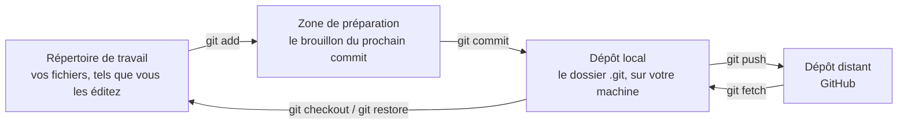
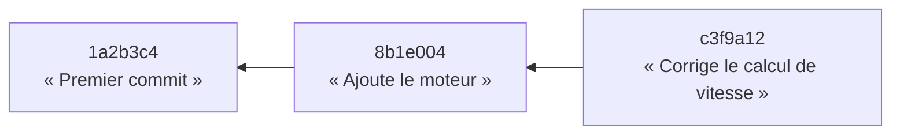
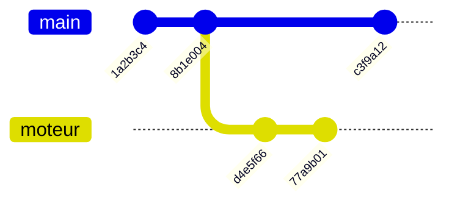
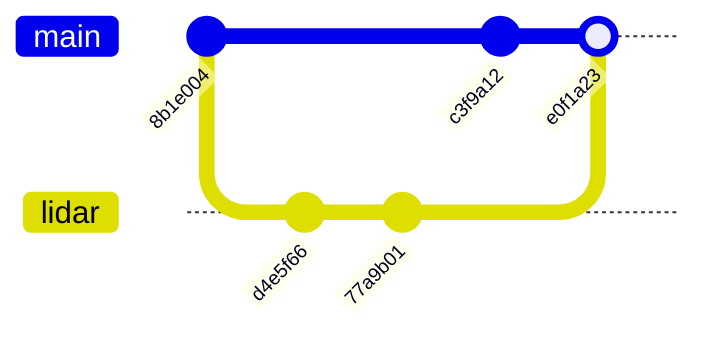
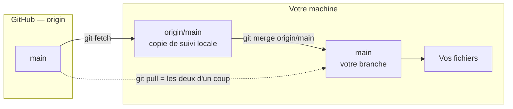
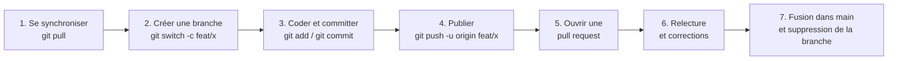

import TabItem from "@theme/TabItem";
import Tabs from "@theme/Tabs";
import {
  BookOpen,
  Cloud,
  Code,
  Download,
  Dumbbell,
  GitBranch,
  GitMerge,
  HardDrive,
  LifeBuoy,
  ListChecks,
  Save,
  Users,
} from "lucide-react";

**Git** est un logiciel qui enregistre l'histoire d'un projet : qui a changé quoi, quand,
et pourquoi. **GitHub** est un site qui héberge des projets Git et ajoute autour d'eux
tout ce qui sert à travailler à plusieurs (discussions, relectures, automatisations).

Ce sont deux choses différentes, et c'est la première source de confusion : **Git
fonctionne parfaitement sans GitHub**. GitHub n'est qu'un endroit de plus où poser une
copie de votre historique.

**Pourquoi apprendre Git ?**

- Revenir à une version qui marchait, même une semaine plus tard.
- Travailler à plusieurs sur le même fichier sans s'écraser mutuellement.
- Essayer une idée risquée dans un coin, sans casser le code qui fonctionne.
- Chez DaVinciBot, **tout** le code passe par Git : sans lui, impossible de contribuer.

**Objectifs d'apprentissage :**

- Comprendre **où vit l'historique** et ce qu'est réellement un commit.
- Maîtriser le cycle local : `status`, `add`, `commit`, `log`.
- Créer des branches, naviguer entre elles, les fusionner et résoudre un conflit.
- Distinguer `fetch`, `pull` et `push`, et savoir lequel utiliser quand.
- Faire tout cela **en ligne de commande** comme **dans VS Code**.
- Contribuer à un projet GitHub via une _pull request_.

:::tip Comment lire cette page
Chaque commande est expliquée avant d'être donnée. Ouvrez un terminal en parallèle et
tapez les commandes au fur et à mesure : Git ne s'apprend pas en lecture seule. Un
[exercice complet](#exercice-récapitulatif) en fin de page reprend tout le parcours.
:::

## <Download /> Prérequis et installation

Aucune connaissance préalable n'est nécessaire, si ce n'est savoir ouvrir un terminal et
se déplacer dans des dossiers. Si ce n'est pas encore le cas, la formation
[Linux Débutant](./linux) couvre ces bases.

### Installer Git

<Tabs groupId="os">
  <TabItem value="windows" label="Windows" default>

Téléchargez **Git for Windows** sur [git-scm.com/download/win](https://git-scm.com/download/win)
et lancez l'installateur. Les options par défaut conviennent.

L'installation fournit aussi **Git Bash**, un terminal qui comprend les commandes Unix.
C'est lui qu'on utilise dans cette formation : les commandes Git y sont identiques à
celles de macOS et Linux.

  </TabItem>
  <TabItem value="macos" label="macOS">

Le plus simple passe par [Homebrew](https://brew.sh) :

```bash
brew install git
```

Sans Homebrew, la commande `git --version` proposera d'installer les _Command Line Tools_
d'Apple, qui incluent Git.

  </TabItem>
  <TabItem value="linux" label="Linux">

```bash
# Debian, Ubuntu, et dérivées
sudo apt install git

# Fedora
sudo dnf install git

# Arch
sudo pacman -S git
```

  </TabItem>
</Tabs>

Vérifiez ensuite l'installation :

```bash
git --version
# git version ...
```

### Se présenter à Git

Chaque commit porte le nom et l'adresse mail de son auteur. Il faut donc les renseigner
**une fois pour toutes** sur votre machine :

```bash
git config --global user.name "Prénom Nom" # ou pseudo GitHub
git config --global user.email "prenom.nom@edu.devinci.fr" # adresse mail publique GitHub
```

:::warning L'adresse mail est publique
Elle apparaît dans chaque commit et reste visible par tout le monde sur GitHub. Pour la
masquer, GitHub fournit une adresse de substitution du type
`12345678+pseudo@users.noreply.github.com`, à récupérer dans
**Settings → Emails → Keep my email addresses private**.
:::

### Créer un compte GitHub

Créez un compte sur [github.com](https://github.com) avec un pseudo lisible : il apparaîtra
sur toutes vos contributions, y compris celles que verront de futurs recruteurs. Demandez
ensuite au pôle info votre invitation dans l'organisation
[DaVinciBot](https://github.com/DaVinciBot).

### Installer VS Code

Téléchargez [VS Code](https://code.visualstudio.com/). Git y est intégré nativement : aucune
extension n'est nécessaire pour commencer. Les extensions utiles sont présentées dans la
[section VS Code](#le-même-travail-dans-vs-code).

## <HardDrive /> Où vit l'historique

C'est **la** section à comprendre. Tout le reste en découle.

### Un dépôt, c'est un dossier `.git`

Quand vous transformez un dossier en projet Git, Git crée à l'intérieur un sous-dossier
caché nommé `.git` :

```bash
mkdir mon-projet
cd mon-projet
git init
# Initialized empty Git repository in /home/vous/mon-projet/.git/
```

Ce dossier `.git` **est** l'historique. Il contient tous les commits, toutes les branches,
toute l'histoire du projet depuis le premier jour. Le reste du dossier — vos fichiers
visibles — n'est qu'une **copie de travail** : la version que Git a sortie de sa réserve
pour que vous puissiez l'éditer.

Deux conséquences immédiates :

- Supprimez `.git`, et vous perdez tout l'historique en gardant les fichiers actuels.
- Copiez le dossier entier sur une clé USB, et vous emportez **l'historique complet** avec
  vous. Pas besoin de réseau pour consulter un commit d'il y a trois mois.

:::info Git est décentralisé
Contrairement aux anciens systèmes de version, il n'existe pas de « serveur central » qui
détiendrait la vérité. Chaque clone d'un projet contient l'intégralité de l'histoire. Si
GitHub disparaissait demain, n'importe quel membre de l'équipe pourrait republier le
projet complet depuis sa machine.
:::

### Les quatre zones

Un fichier traverse quatre endroits, et chaque commande Git sert à le faire passer de l'un
à l'autre. C'est le schéma mental à retenir :



| Zone                      | Ce qu'elle contient                                              | Comment y entrer |
| ------------------------- | ---------------------------------------------------------------- | ---------------- |
| **Répertoire de travail** | Les fichiers que vous voyez et modifiez                          | Votre éditeur    |
| **Zone de préparation**   | La sélection des modifications qui iront dans le prochain commit | `git add`        |
| **Dépôt local** (`.git`)  | Tous vos commits, toutes vos branches                            | `git commit`     |
| **Dépôt distant**         | La copie partagée, sur GitHub                                    | `git push`       |

La zone de préparation — _staging area_, ou _index_ — est l'étape que les débutants
trouvent inutile au début, puis indispensable ensuite. Elle permet de **choisir** ce qui
part dans un commit : si vous avez corrigé un bug _et_ renommé trois variables au passage,
vous pouvez faire deux commits séparés au lieu d'un fourre-tout.

### Ce qu'est vraiment un commit

Un commit n'est pas « la liste des lignes modifiées ». C'est une **photo complète du
projet** à un instant donné, accompagnée de :

- un **identifiant** unique, le _hash_ (`a3f7b21…`, souvent abrégé aux 7 premiers caractères) ;
- un **auteur** et une **date** ;
- un **message** qui explique le pourquoi ;
- un **parent** : le commit qui précède.

Ce dernier point est le mécanisme central. Chaque commit pointe vers son parent, ce qui
forme une chaîne remontant jusqu'au tout premier commit. **L'historique, c'est cette
chaîne.**



:::note Un commit est immuable
Une fois créé, un commit ne change plus : son hash est calculé à partir de son contenu,
de son message et de son parent. « Modifier » un commit revient toujours à en créer un
nouveau et à abandonner l'ancien. C'est ce qui rend l'historique fiable.
:::

### Branches et `HEAD`

Une **branche** n'est ni un dossier, ni une copie du projet. C'est une simple **étiquette
posée sur un commit**, qui avance automatiquement à chaque nouveau commit. Créer une
branche coûte donc quelques octets et zéro seconde.

**`HEAD`** est une seconde étiquette, qui indique _où vous êtes_ : sur quelle branche vous
travaillez en ce moment. Changer de branche, c'est déplacer `HEAD` — et Git remplace au
passage le contenu de votre répertoire de travail par celui du commit visé.



Ici `main` et `moteur` sont deux étiquettes sur deux commits différents. Les deux histoires
ont divergé après `8b1e004` — c'est exactement ce qu'on veut quand deux personnes
travaillent en parallèle.

### GitHub dans tout ça

GitHub héberge une copie de votre dépôt, appelée **dépôt distant** (_remote_). Par
convention, ce distant s'appelle `origin`.

Rien ne circule automatiquement entre votre machine et GitHub : **vous** décidez quand
envoyer (`push`) et quand récupérer (`fetch` / `pull`). Tant que vous n'avez pas poussé,
vos commits n'existent que sur votre disque — et une panne de disque les emporte.

## <Save /> Le cycle local : status, add, commit

Le travail quotidien tient en une boucle : je modifie, je regarde, je prépare, j'enregistre.

### `git status` — la commande à taper tout le temps

```bash
git status
```

Elle répond à trois questions : sur quelle branche suis-je, qu'est-ce qui a changé, et
qu'est-ce qui est déjà préparé. En cas de doute, `git status` suggère presque toujours la
commande suivante à taper. Prenez l'habitude de la lancer avant et après chaque opération.

```
On branch main
Changes not staged for commit:
  (use "git add <file>..." to update what will be committed)
        modified:   moteur.py

Untracked files:
  (use "git add <file>..." to include in what will be committed)
        notes.txt
```

Ce message distingue deux états courants :

- **`modified`** — un fichier déjà suivi par Git a changé.
- **`untracked`** — un fichier que Git n'a jamais vu et qu'il ignore pour l'instant.

### `git add` — préparer (_stage_)

`git add` déplace des modifications du répertoire de travail vers la zone de préparation.
C'est ce qu'on appelle **stager** un changement.

```bash
git add moteur.py          # un fichier précis
git add src/               # tout un dossier
git add .                  # tout ce qui a changé sous le dossier courant
git add -p                 # sélectionner morceau par morceau (mode interactif)
```

:::tip `git add -p`, le mode qui fait progresser
`-p` (pour _patch_) présente chaque bloc de modification et demande s'il faut l'inclure :
`y` (oui), `n` (non), `q` (quitter). C'est la façon la plus simple de découper un gros
chantier en commits propres — et de relire son propre code au passage.
:::

Un fichier stagé par erreur se retire sans perdre les modifications :

```bash
git restore --staged moteur.py
```

### `git commit` — enregistrer

```bash
git commit -m "Corrige le calcul de vitesse du moteur gauche"
```

Le commit prend **uniquement** ce qui est dans la zone de préparation. Ce qui est modifié
mais non stagé reste en attente.

Un bon message de commit décrit **l'intention**, pas la manipulation. `« Corrige le
dépassement de la file d'attente LiDAR »` est utile dans six mois ; `« fix »`,
`« update »` ou `« modif »` ne le sont jamais.

Conventions courantes, largement utilisées chez DaVinciBot :

- verbe à l'infinitif ou à l'impératif, en tête de message ;
- une ligne de résumé courte (~50 caractères), puis une ligne vide, puis les détails ;
- éventuellement un préfixe de type : `feat:`, `fix:`, `docs:`, `refactor:`, `test:`.

```bash
git commit -m "feat: ajoute la détection d'obstacle par LiDAR

Le seuil de distance est configurable via config.yaml.
Fixe l'issue #42."
```

### `git log` — relire l'histoire

```bash
git log                                  # historique détaillé
git log --oneline                        # une ligne par commit
git log --oneline --graph --all          # avec le dessin des branches
git log -p moteur.py                     # l'historique d'un seul fichier, avec les diffs
```

```
c3f9a12 (HEAD -> main) Corrige le calcul de vitesse
8b1e004 Ajoute le moteur
1a2b3c4 Premier commit
```

La mention `(HEAD -> main)` confirme visuellement ce que dit la théorie : `HEAD` pointe sur
`main`, et `main` pointe sur `c3f9a12`.

### `git diff` — voir précisément ce qui change

```bash
git diff              # modifications non préparées
git diff --staged     # modifications préparées, prêtes à être commitées
```

### `.gitignore` — ce que Git doit ignorer

Certains fichiers n'ont rien à faire dans l'historique : binaires compilés, dépendances
téléchargées, secrets, fichiers de l'éditeur. On les liste dans un fichier `.gitignore` à
la racine du projet :

```text
# Dépendances
node_modules/
__pycache__/

# Fichiers de build
build/
*.o

# Secrets — ne JAMAIS committer
.env

# Système
.DS_Store
```

:::danger Un secret commité est un secret compromis
Effacer un mot de passe ou une clé d'API dans un commit ultérieur **ne le supprime pas** :
il reste lisible dans l'historique. La seule réaction correcte est de **révoquer la clé
immédiatement**, puis de la remplacer. Ajoutez `.env` à `.gitignore` avant le premier
commit, pas après.
:::

## <GitBranch /> Branches, checkout et merge

### Créer et changer de branche

La règle de travail est simple : **on ne développe jamais directement sur `main`**. Chaque
fonctionnalité, chaque correction vit sur sa propre branche.

```bash
git branch                       # lister les branches locales
git branch feat/lidar            # créer une branche (sans s'y déplacer)
git switch feat/lidar            # s'y déplacer
git switch -c feat/lidar         # créer ET s'y déplacer (le raccourci habituel)
git switch main                  # revenir sur main
```

Les noms de branches suivent en général un préfixe de type, avec un slash :
`feat/detection-lidar`, `fix/moteur-gauche`, `docs/formation-git`.

:::note `switch` ou `checkout` ?
Historiquement, **`git checkout`** faisait tout : changer de branche, mais aussi restaurer
des fichiers. Cette double fonction provoquait des accidents. Git a donc scindé la commande
en deux, plus lisibles :

- **`git switch`** — changer de branche ;
- **`git restore`** — restaurer des fichiers.

`git checkout` fonctionne toujours et reste omniprésent dans les tutoriels et les
discussions : `git checkout -b ma-branche` équivaut à `git switch -c ma-branche`. Utilisez
`switch` et `restore` pour écrire, sachez lire `checkout`.
:::

Changer de branche **remplace le contenu de vos fichiers**. Git refuse de le faire si vous
avez des modifications non commitées qui seraient écrasées. Deux issues : committer, ou
mettre de côté temporairement :

```bash
git stash             # range les modifications en cours dans un tiroir
git switch main
# ... plus tard, de retour sur la branche ...
git stash pop         # les ressort du tiroir
```

### Fusionner avec `git merge`

Fusionner, c'est ramener le travail d'une branche dans une autre. On se place **dans la
branche qui doit recevoir**, puis on fusionne celle qui apporte :

```bash
git switch main             # je me place sur la branche de destination
git merge feat/lidar        # j'y intègre la branche de fonctionnalité
```



Le commit `e0f1a23` est un **commit de fusion** : c'est le seul type de commit à avoir deux
parents. Il recoud les deux histoires.

Une fois la branche fusionnée, elle ne sert plus à rien et peut être supprimée :

```bash
git branch -d feat/lidar
```

### Résoudre un conflit

Un **conflit** survient quand deux branches modifient les **mêmes lignes** du même fichier.
Git ne peut pas deviner laquelle garder, alors il s'arrête et vous laisse trancher.

```
Auto-merging moteur.py
CONFLICT (content): Merge conflict in moteur.py
Automatic merge failed; fix conflicts and then commit the result.
```

Le fichier concerné contient alors les deux versions, encadrées par des marqueurs :

```python
def vitesse_max():
<<<<<<< HEAD
    return 120  # votre version, celle de la branche courante
=======
    return 150  # la version qui arrive, celle de feat/lidar
>>>>>>> feat/lidar
```

La résolution se fait en trois temps :

1. **Éditer** le fichier : supprimer les marqueurs `<<<<<<<`, `=======`, `>>>>>>>` et ne
   laisser que le code voulu — l'une des versions, l'autre, ou une combinaison des deux.
2. **Stager** le fichier résolu : `git add moteur.py`.
3. **Conclure** la fusion : `git commit` (le message est pré-rempli).

Pour abandonner et revenir à l'état d'avant la fusion :

```bash
git merge --abort
```

:::tip Un conflit n'est pas une erreur
C'est simplement Git qui refuse de choisir à votre place. Les conflits deviennent rares et
petits dès qu'on commite souvent et qu'on synchronise régulièrement avec `main`.
:::

## <Cloud /> Travailler avec GitHub : clone, fetch, pull, push

### Le dépôt distant

```bash
git remote -v
# origin  https://github.com/DaVinciBot/DocVB.git (fetch)
# origin  https://github.com/DaVinciBot/DocVB.git (push)
```

`origin` est le nom local du dépôt distant. Ce n'est qu'une convention : c'est un
raccourci vers une URL.

Pour repartir d'un projet existant sur GitHub, on le **clone** — ce qui télécharge
l'intégralité de l'historique et configure `origin` automatiquement :

```bash
git clone https://github.com/DaVinciBot/DocVB.git
cd DocVB
```

### HTTPS ou SSH ?

Deux façons de vous authentifier auprès de GitHub :

<Tabs groupId="auth">
  <TabItem value="https" label="HTTPS" default>

L'URL commence par `https://`. GitHub demande un **jeton d'accès personnel** (_Personal
Access Token_) au lieu d'un mot de passe : il se génère dans
**Settings → Developer settings → Personal access tokens**.

Le plus simple sur Windows et macOS reste d'installer
[GitHub CLI](https://cli.github.com/) et de lancer `gh auth login`, qui configure le
stockage sécurisé du jeton pour vous.

  </TabItem>
  <TabItem value="ssh" label="SSH">

L'URL commence par `git@github.com:`. L'authentification passe par une paire de clés
générée une fois :

```bash
ssh-keygen -t ed25519 -C "prenom.nom@edu.devinci.fr"
cat ~/.ssh/id_ed25519.pub
```

Copiez la clé **publique** affichée (celle en `.pub`, jamais l'autre) et collez-la dans
**GitHub → Settings → SSH and GPG keys → New SSH key**. Vérifiez ensuite :

```bash
ssh -T git@github.com
# Hi pseudo! You've successfully authenticated...
```

  </TabItem>
</Tabs>

### `git fetch` — regarder sans toucher

```bash
git fetch origin
```

`fetch` télécharge les nouveaux commits du distant et met à jour des branches de suivi
locales nommées `origin/main`, `origin/feat/lidar`… **Vos fichiers et votre branche ne
bougent pas d'un octet.**

C'est l'opération la plus sûre de Git : elle ne peut rien casser. Après un `fetch`, vous
pouvez inspecter ce qui vous attend :

```bash
git log --oneline main..origin/main     # les commits que vous n'avez pas encore
git diff main origin/main               # ce qu'ils changent concrètement
```

### `git pull` — récupérer et intégrer

```bash
git pull origin main
```

`pull` = `fetch` **puis** `merge`. Il télécharge, _et_ fusionne immédiatement dans votre
branche courante — ce qui peut produire un conflit sur le champ.



:::tip Lequel utiliser ?
`pull` pour le quotidien, quand vous savez que vous voulez la dernière version. `fetch`
puis `log` quand vous voulez d'abord **voir** ce que les autres ont fait — typiquement
avant de reprendre une branche laissée de côté quelques jours.
:::

### `git push` — publier

```bash
git push origin main
```

`push` envoie vos commits locaux vers le distant. C'est le moment où votre travail devient
visible par l'équipe — et sauvegardé ailleurs que sur votre disque.

La première fois qu'on pousse une branche nouvellement créée, il faut indiquer à Git où
elle doit vivre côté distant :

```bash
git push -u origin feat/lidar
```

L'option `-u` (_upstream_) crée le lien une fois pour toutes : ensuite, un simple
`git push` suffit sur cette branche.

:::warning Push rejeté ?

```text
! [rejected] main -> main (fetch first)
```

Ce message signifie que le distant contient des commits que vous n'avez pas. Git protège
le travail des autres en refusant de l'écraser. La solution est toujours la même :
`git pull`, résoudre l'éventuel conflit, puis `git push`.

**N'utilisez jamais `git push --force` pour contourner ce message** sur une branche
partagée : cela supprime définitivement le travail de vos collègues du distant.
:::

## <Code /> Le même travail dans VS Code {#le-même-travail-dans-vs-code}

VS Code intègre Git nativement, sans extension. Tout se passe dans le panneau **Source
Control**, qu'on ouvre avec l'icône en forme de branche dans la barre latérale ou par

<kbd>Ctrl</kbd>+<kbd>Shift</kbd>+<kbd>G</kbd> (<kbd>Cmd</kbd>+<kbd>Shift</kbd>+
<kbd>G</kbd>
sur macOS).

{/* TODO capture d'écran : déposer `01-vscode-source-control.png` dans `static/img/tutorials/info/git/`,
puis supprimer les deux lignes de commentaire qui encadrent le bloc ci-dessous.

*Le panneau Source Control : la zone Changes liste les fichiers modifiés, Staged Changes ce qui est préparé.\*
\*/}

### La correspondance avec la ligne de commande

Chaque bouton de l'interface exécute une commande. Connaître la correspondance permet de
passer de l'un à l'autre sans se perdre :

| Dans VS Code                                                     | En ligne de commande          |
| ---------------------------------------------------------------- | ----------------------------- |
| Liste **Changes**                                                | `git status`                  |
| Icône **+** sur un fichier (_Stage Changes_)                     | `git add fichier`             |
| Icône **+** sur l'en-tête **Changes**                            | `git add .`                   |
| Icône **−** (_Unstage Changes_)                                  | `git restore --staged`        |
| Icône **↩** (_Discard Changes_)                                  | `git restore fichier`         |
| Zone de message + **Commit** (<kbd>Ctrl</kbd>+<kbd>Entrée</kbd>) | `git commit -m "…"`           |
| Bouton **Sync Changes**                                          | `git pull` puis `git push`    |
| **⋯ → Pull** / **⋯ → Push** / **⋯ → Fetch**                      | `git pull` / `push` / `fetch` |
| Nom de branche en bas à gauche                                   | `git switch`                  |
| **⋯ → Branch → Create Branch**                                   | `git switch -c`               |
| **⋯ → Branch → Merge**                                           | `git merge`                   |
| Clic sur un fichier modifié                                      | `git diff fichier`            |

### Préparer et committer

Cliquer sur un fichier de la liste **Changes** ouvre une vue côte à côte : l'ancienne
version à gauche, la nouvelle à droite. C'est un `git diff` visuel, et le meilleur moment
pour se relire.

{/* TODO capture d'écran : déposer `02-vscode-stage-changes.png` dans `static/img/tutorials/info/git/`,
puis supprimer les deux lignes de commentaire qui encadrent le bloc ci-dessous.

*Le survol d'un fichier fait apparaître les icônes : + pour stager, ↩ pour annuler les modifications.\*
\*/}

L'équivalent de `git add -p` existe aussi : sélectionnez quelques lignes dans la vue de
comparaison, faites un clic droit, puis **Stage Selected Ranges**. Vous ne préparez alors
que ces lignes-là.

Le message de commit se saisit dans la zone de texte en haut du panneau, et

<kbd>Ctrl</kbd>+<kbd>Entrée</kbd> valide.

{/* TODO capture d'écran : déposer `03-vscode-commit.png` dans `static/img/tutorials/info/git/`,
puis supprimer les deux lignes de commentaire qui encadrent le bloc ci-dessous.

*Le bouton Commit ne prend que les Staged Changes, exactement comme en ligne de commande.\*
\*/}

:::warning Le bouton « Commit » quand rien n'est stagé
Si la zone **Staged Changes** est vide, VS Code propose de committer **toutes** les
modifications d'un coup (l'équivalent de `git commit -a`). Pratique, mais c'est aussi
comme cela qu'on se retrouve avec des commits fourre-tout. Prenez l'habitude de stager
explicitement.
:::

### Changer de branche et fusionner

Le nom de la branche courante s'affiche **en bas à gauche** de la fenêtre. Un clic dessus
ouvre la liste des branches et permet d'en créer une nouvelle.

{/* TODO capture d'écran : déposer `04-vscode-branch-switcher.png` dans `static/img/tutorials/info/git/`,
puis supprimer les deux lignes de commentaire qui encadrent le bloc ci-dessous.

*Le sélecteur de branche : changer de branche, en créer une, ou récupérer une branche distante.\*
\*/}

En cas de conflit, VS Code propose son **éditeur de fusion** (_Merge Editor_), bien plus
lisible que les marqueurs `<<<<<<<` dans le fichier brut : la version entrante à gauche,
la vôtre à droite, le résultat en bas. Chaque bloc en conflit propose **Accept Current**,
**Accept Incoming** ou **Accept Combination**, et le résultat reste éditable à la main.

{/* TODO capture d'écran : déposer `05-vscode-merge-editor.png` dans `static/img/tutorials/info/git/`,
puis supprimer les deux lignes de commentaire qui encadrent le bloc ci-dessous.

*L'éditeur de fusion remplace l'édition manuelle des marqueurs de conflit.\*
\*/}

### Visualiser l'historique

VS Code affiche le graphe des commits directement dans le panneau Source Control, sous la
section **Graph** — l'équivalent visuel de `git log --oneline --graph --all`.

{/* TODO capture d'écran : déposer `06-vscode-graph.png` dans `static/img/tutorials/info/git/`,
puis supprimer les deux lignes de commentaire qui encadrent le bloc ci-dessous.

*Le graphe montre les branches, les fusions et la position de HEAD.\*
\*/}

### Extensions utiles

| Extension                                                                                                                | Ce qu'elle apporte                                                                  |
| ------------------------------------------------------------------------------------------------------------------------ | ----------------------------------------------------------------------------------- |
| [GitLens](https://marketplace.visualstudio.com/items?itemName=eamodio.gitlens)                                           | Affiche en bout de ligne qui a écrit quoi et quand (_blame_), et enrichit le graphe |
| [GitHub Pull Requests and Issues](https://marketplace.visualstudio.com/items?itemName=GitHub.vscode-pull-request-github) | Créer, relire et commenter des pull requests sans quitter l'éditeur                 |
| [Conventional Commits](https://marketplace.visualstudio.com/items?itemName=vivaxy.vscode-conventional-commits)           | Guide la rédaction de messages `feat:` / `fix:` au format conventionnel             |

:::tip Interface ou terminal ?
Les deux, et sans culpabilité. L'interface est plus rapide pour relire un diff, stager des
lignes précises ou résoudre un conflit. Le terminal reste indispensable dès qu'on sort des
sentiers battus — et c'est le seul langage commun quand on demande de l'aide. Comprendre
ce que chaque bouton exécute vous rend autonome dans les deux.
:::

## <Users /> Le workflow GitHub en équipe

### Le cycle d'une contribution



### La pull request

Une **pull request** (PR) est une demande d'intégration : « voici ma branche, merci de la
relire et de la fusionner dans `main` ». C'est le cœur du travail collaboratif sur GitHub,
et ce n'est **pas** une commande Git — c'est une fonctionnalité du site.

Après un `git push -u origin feat/lidar`, GitHub affiche un bandeau **Compare & pull
request** sur la page du dépôt. Il reste à :

1. choisir la branche de destination (`main` en général) ;
2. écrire un titre clair et une description : **ce que ça change et pourquoi** ;
3. lier l'issue concernée en écrivant `Closes #42` dans la description ;
4. demander une relecture à un membre de l'équipe (_Reviewers_).

{/* TODO capture d'écran : déposer `07-github-pull-request.png` dans `static/img/tutorials/info/git/`,
puis supprimer les deux lignes de commentaire qui encadrent le bloc ci-dessous.

*L'ouverture d'une pull request : titre, description, relecteurs et branche de destination.\*
\*/}

Tant que la PR est ouverte, **chaque nouveau `git push` sur la branche la met à jour
automatiquement**. Répondre à une remarque de relecture consiste donc simplement à
committer et pousser à nouveau.

{/* TODO capture d'écran : déposer `08-github-review.png` dans `static/img/tutorials/info/git/`,
puis supprimer les deux lignes de commentaire qui encadrent le bloc ci-dessous.

*La relecture se fait ligne par ligne dans l'onglet Files changed.\*
\*/}

### Les issues

Une **issue** est un ticket : un bug à corriger, une fonctionnalité à ajouter, une question
ouverte. Elles servent à répartir le travail et à garder une trace des décisions. Une bonne
issue de bug contient ce qui était attendu, ce qui s'est produit, et comment reproduire.

### Le _fork_

Sur un projet où vous n'avez pas les droits d'écriture — un projet open source, par
exemple —, vous ne pouvez pas pousser de branche. Le **fork** résout ça : c'est une copie
personnelle du dépôt sur votre propre compte GitHub.

```bash
# 1. Cliquer sur "Fork" sur la page du projet, puis :
git clone https://github.com/VOTRE-PSEUDO/le-projet.git
cd le-projet

# 2. Garder un lien vers le dépôt d'origine pour se synchroniser
git remote add upstream https://github.com/ORG-ORIGINE/le-projet.git

# 3. Avant de commencer, récupérer les nouveautés du projet d'origine
git fetch upstream
git merge upstream/main
```

Vous poussez ensuite sur **votre** fork (`origin`), et vous ouvrez la pull request depuis
votre fork vers le dépôt d'origine.

:::info Chez DaVinciBot
Les membres de l'organisation ont les droits d'écriture sur les dépôts de l'équipe : les
branches se poussent directement, sans fork. Voir
[Contribuer aux sites DaVinciBot](../../mini-projects/how-to-contribute-to-dvbsites.md) pour la mise en place
concrète de l'environnement.
:::

## <LifeBuoy /> Se sortir des ennuis

Presque tout se rattrape avec Git. Voici les situations les plus fréquentes.

### Annuler avant d'avoir commité

```bash
# Abandonner les modifications d'un fichier (IRRÉVERSIBLE)
git restore moteur.py

# Retirer un fichier de la zone de préparation, sans perdre les modifications
git restore --staged moteur.py
```

### Corriger le dernier commit

```bash
# Changer le message du dernier commit
git commit --amend -m "Un message enfin correct"

# Ajouter un fichier oublié au dernier commit
git add fichier-oublie.py
git commit --amend --no-edit
```

:::warning `--amend` réécrit l'historique
Le commit corrigé est en réalité un **nouveau** commit, avec un nouveau hash. À ne faire
que sur des commits **non encore poussés**. Sur un commit déjà partagé, préférez un
nouveau commit correctif.
:::

### Annuler un commit déjà poussé

```bash
git revert c3f9a12
```

`revert` crée un **nouveau** commit qui défait les changements du commit visé. L'historique
est préservé, rien n'est réécrit : c'est la méthode sûre sur une branche partagée.

### Retrouver un travail perdu

```bash
git reflog
```

`reflog` liste **tous** les déplacements de `HEAD` des derniers jours, y compris ceux qui
ne sont plus rattachés à aucune branche. Une branche supprimée par erreur, un `reset`
malheureux : la trace y est presque toujours, et on y revient avec
`git switch -c sauvetage <hash>`.

:::tip La règle qui sauve
Tant qu'un travail a été **commité** au moins une fois, il est presque toujours
récupérable. Ce qui se perd vraiment, c'est ce qui n'a jamais été commité. D'où le conseil
le plus utile de cette page : **commitez souvent**, quitte à nettoyer ensuite.
:::

### Erreurs courantes de débutant

| Symptôme                                                | Cause                                        | Solution                                       |
| ------------------------------------------------------- | -------------------------------------------- | ---------------------------------------------- |
| `fatal: not a git repository`                           | Vous n'êtes pas dans un dossier suivi        | `cd` dans le bon dossier, ou `git init`        |
| Le commit ne contient pas mes changements               | Fichiers modifiés mais non stagés            | `git add` avant `git commit`                   |
| `! [rejected] ... (fetch first)`                        | Le distant a des commits que vous n'avez pas | `git pull` puis `git push`                     |
| `Please tell me who you are`                            | `user.name` / `user.email` non configurés    | Voir [Se présenter à Git](#se-présenter-à-git) |
| Mes fichiers ont disparu après un changement de branche | Ils n'existaient que sur l'autre branche     | `git switch` sur la branche d'origine          |
| `node_modules` apparaît dans `git status`               | `.gitignore` absent ou incomplet             | Ajouter l'entrée au `.gitignore`               |

## <ListChecks /> Aide-mémoire

| Commande                       | Effet                                                     |
| ------------------------------ | --------------------------------------------------------- |
| `git init`                     | Transformer le dossier courant en dépôt Git               |
| `git clone <url>`              | Copier un dépôt distant, historique compris               |
| `git status`                   | Voir l'état du répertoire de travail et de la préparation |
| `git add <fichier>`            | Préparer (_stager_) des modifications                     |
| `git restore --staged <f>`     | Retirer un fichier de la préparation                      |
| `git restore <fichier>`        | Abandonner les modifications non préparées                |
| `git commit -m "message"`      | Enregistrer la préparation dans un commit                 |
| `git commit --amend`           | Corriger le dernier commit (non poussé)                   |
| `git log --oneline --graph`    | Lire l'historique sous forme de graphe                    |
| `git diff`                     | Voir les modifications non préparées                      |
| `git branch`                   | Lister les branches                                       |
| `git switch -c <branche>`      | Créer une branche et s'y déplacer                         |
| `git switch <branche>`         | Changer de branche                                        |
| `git merge <branche>`          | Fusionner une branche dans la branche courante            |
| `git stash` / `git stash pop`  | Mettre de côté / reprendre des modifications en cours     |
| `git fetch`                    | Récupérer les nouveautés du distant, sans rien modifier   |
| `git pull`                     | `fetch` + `merge` dans la branche courante                |
| `git push`                     | Envoyer ses commits vers le distant                       |
| `git push -u origin <branche>` | Publier une nouvelle branche et créer le lien de suivi    |
| `git revert <hash>`            | Annuler un commit par un nouveau commit                   |
| `git reflog`                   | Retrouver un état perdu                                   |

## <Dumbbell /> Exercice récapitulatif {#exercice-récapitulatif}

Ce parcours reprend tout ce qui précède. Comptez une trentaine de minutes.

1. Créez un dépôt vide nommé `apprentissage-git` sur GitHub, **sans** README.
2. En local, créez un dossier du même nom, initialisez-le avec `git init`, ajoutez un
   fichier `README.md` contenant une ligne de présentation.
3. Vérifiez l'état avec `git status`, stagez le fichier, commitez-le, puis relisez
   l'historique avec `git log --oneline`.
4. Reliez le dépôt local à GitHub et publiez :
   ```bash
   git remote add origin <url-de-votre-depot>
   git push -u origin main
   ```
5. Créez une branche `feat/presentation`, ajoutez-y un fichier `presentation.md`, commitez,
   puis poussez la branche avec `-u`.
6. Ouvrez une **pull request** sur GitHub, écrivez-y une description, puis fusionnez-la.
7. Revenez sur `main` en local, faites `git pull` : le fichier `presentation.md` apparaît.
   Supprimez la branche locale devenue inutile.
8. **Provoquez un conflit volontairement** : modifiez la première ligne du `README.md`
   directement sur GitHub (bouton crayon) et commitez ; modifiez **la même ligne**
   différemment en local, commitez, puis lancez `git pull`.
9. Résolvez le conflit — une fois dans l'éditeur de fusion de VS Code, une fois à la main
   dans le fichier pour voir les marqueurs — puis `git add`, `git commit`, `git push`.
10. Terminez avec `git log --oneline --graph --all` : vous devez y reconnaître vos branches,
    votre commit de fusion et la position de `HEAD`.

Si l'étape 10 est lisible pour vous, l'essentiel est acquis.

## <BookOpen /> Ressources

### Documentation officielle

- [Documentation Git](https://git-scm.com/doc) — la référence complète de toutes les commandes.
- [**Pro Git**, en français](https://git-scm.com/book/fr/v2) — le livre de référence, gratuit et en ligne. Les chapitres 1 à 3 couvrent tout ce qui est vu ici, en plus détaillé.
- [Documentation GitHub en français](https://docs.github.com/fr) — pull requests, issues, permissions, Actions.
- [Git dans VS Code](https://code.visualstudio.com/docs/sourcecontrol/overview) — la documentation officielle du panneau Source Control.

### Tutoriels de référence

- [GitHub Skills](https://skills.github.com/) — parcours interactifs officiels, à faire directement dans un vrai dépôt.
- [Tutoriels Git d'Atlassian](https://www.atlassian.com/fr/git/tutorials) — excellentes explications illustrées, en français.
- [Git Immersion](https://gitimmersion.com/) — une cinquantaine de micro-exercices guidés, en anglais.

### Jeux et visualisations

- [**Learn Git Branching**](https://learngitbranching.js.org/?locale=fr_FR) — le meilleur outil pour comprendre les branches : chaque commande dessine le graphe en direct. À faire absolument.
- [**Oh My Git!**](https://ohmygit.org/) — un jeu de cartes open source qui enseigne Git ; téléchargeable, disponible en français.
- [Visualizing Git](https://git-school.github.io/visualizing-git/) — un bac à sable : tapez une commande, voyez le graphe bouger.
- [Git Exercises](https://gitexercises.fracz.com/) — une série d'exercices corrigés automatiquement.

### Aide-mémoire

- [Aide-mémoire GitHub (PDF, français)](https://education.github.com/git-cheat-sheet-education.pdf) — une page recto-verso à imprimer.
- [Git Cheatsheet interactive](https://ndpsoftware.com/git-cheatsheet.html) — les commandes classées selon les quatre zones vues plus haut.
- [**Dangit, Git!?!**](https://dangitgit.com/fr) — « je viens de faire une bêtise, comment je m'en sors ? », classé par situation.

### Vidéos

- [Grafikart — Apprendre Git](https://grafikart.fr/formations/git) _(français)_ — formation complète et progressive.
- [freeCodeCamp — Git and GitHub for Beginners](https://www.youtube.com/watch?v=RGOj5yH7evk) _(anglais, 1 h)_ — un cours complet en une vidéo.
- [Fireship — Git and GitHub in 100 seconds](https://www.youtube.com/watch?v=hwP7WQkmECE) _(anglais, 2 min)_ — la vue d'ensemble en accéléré.

### Outils et extensions

- [GitHub CLI](https://cli.github.com/) — gérer PR et issues depuis le terminal (`gh pr create`, `gh pr checkout`).
- [GitLens](https://marketplace.visualstudio.com/items?itemName=eamodio.gitlens) — l'extension VS Code qui montre l'histoire ligne par ligne.
- [GitHub Pull Requests and Issues](https://marketplace.visualstudio.com/items?itemName=GitHub.vscode-pull-request-github) — relire et créer des PR depuis VS Code.
- [gitignore.io](https://www.toptal.com/developers/gitignore) — génère un `.gitignore` adapté à votre langage et à votre éditeur.
